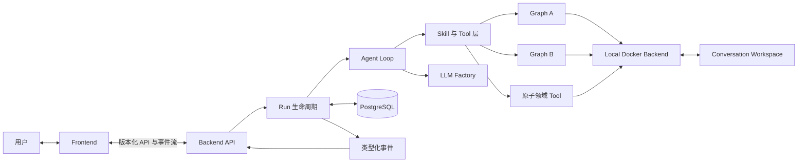

# OmniCell-Agent 架构设计

## 文档控制

| 字段 | 内容 |
| --- | --- |
| 文档状态 | 生效中的架构基线 |
| 所在分支 | `codex/agent-loop-frontend-redesign` |
| 当前阶段 | Phase 11：已完成 |
| 最近更新 | 2026-07-23 |
| 适用范围 | 单机科研原型架构重构 |

本文档是 OmniCell-Agent 本轮重构的唯一架构设计基线，用于约束系统边界、职责划分、实施顺序与完成标准。本文档有意避免类、函数、接口地址等代码级设计，使具体实现可以在不偏离系统架构的前提下演进。

本项目定位为研究生毕业设计的单机科研原型。架构优先服务于科学能力保留、实验可复现、结构清晰和本地完整演示；本文出现的隔离、恢复与校验边界不代表生产级 SLA，也不应继续外推为复杂的平台工程。

每完成一个实施阶段，必须在同一次变更中更新本文档的进度台账。只有该阶段声明的证据门槛全部通过，才能将其标记为“已完成”。

## 1. 建设目标

OmniCell-Agent 将从以固定工作流为主的应用，演进为保留成熟单细胞分析能力的 Agent 产品。

目标系统采用 `backend + frontend` monorepo，包含：

- 一个小而通用的 Agent Loop，负责理解目标、选择能力、迭代执行和判断完成；
- 将 Graph A 与 Graph B 保留为一等领域工作流，并以 Skill 和 Tool 的形式供 Agent 调用；
- 一个隔离的数据与代码执行环境 Local Docker Backend；
- 基于 PostgreSQL 的 conversation、run、event、artifact 与 LangGraph checkpoint 持久化；
- 基于逻辑别名的、与模型供应商解耦的 LLM Factory；
- 一套由 backend 与 frontend 共同遵守的类型化流式事件契约；
- 一个面向 conversation 的 Web 界面，用于发起、观察、审核、恢复和继续分析任务。

## 2. 架构原则

### 2.1 保留领域核心能力

Graph A 和 Graph B 是产品的核心能力，而不是等待删除的旧代码。重构可以改变它们的调用方式、运行环境、持久化方式和可观测方式，但不得在没有明确决策与验证的情况下削弱其分析行为。

### 2.2 分离编排与执行

Agent Loop 负责决定使用哪项能力以及任务是否应继续；领域工作流负责完成已知的生物分析任务；Docker Backend 负责提供隔离的执行环境。三者职责必须分离。

### 2.3 通过稳定能力边界调用

Agent 通过类型明确的 Skill 和 Tool 使用领域能力，而不依赖工作流内部节点。完整工作流和适合复用的领域步骤可以同时对外暴露，让 Agent 根据任务选择适当的控制粒度。

### 2.4 大型科学数据不进入控制状态

Agent 与工作流的 checkpoint 只保存轻量控制信息和资源引用。数据集、AnnData 对象、图片、表格、生成文件及大型执行输出应保存在 conversation workspace 与 artifact 层。

### 2.5 生命周期必须可观察、可恢复

每个 run 都具有明确的开始、顺序事件流、终态、checkpoint 身份和 artifact 集合。取消、中断、重连和人工审核属于运行生命周期状态，而不是普通的传输异常。

### 2.6 按角色配置模型

领域代码只引用逻辑 LLM 角色，不直接依赖供应商或具体模型名。供应商凭据、模型选择、流式行为和能力约束由统一工厂解析。

### 2.7 跨端共享契约，不共享内部模型

Backend 与 frontend 共享版本化的 API 和事件契约。LangGraph 内部状态、数据库行结构和 frontend store 结构均不属于公共契约。

### 2.8 进度是架构治理的一部分

实施进度、完成证据、阻塞条件和架构决策统一记录在本文档中。代码已经完成但没有同步更新进度，仍视为该阶段未完成。

### 2.9 设计文档统一使用中文

本项目新增或更新的架构、设计和进度类文档必须以中文为主体，仅保留必要的英文技术标识、协议名、文件名和代码标识符。

## 3. 范围与非目标

### 本轮范围

- 将仓库重构为 `backend/` 与 `frontend/` 主体的 monorepo。
- 保留 Graph A/B，并将其纳入 Skill/Tool 能力体系。
- 建设 Agent Loop 与完整 run 生命周期。
- 建设 Local Docker Backend。
- 建设 PostgreSQL 持久化与 LangGraph checkpointer。
- 建设 LLM provider、alias 与 factory 抽象。
- 建设类型化事件流与 frontend 产品界面。
- 建设核心能力保留、故障恢复和端到端验证体系。

### 非目标

- 不为适配 Agent Loop 而重写 Graph A 或 Graph B 的科学逻辑。
- 不允许 LLM 用不受约束的代码生成替代确定性生物分析操作。
- 不整体复制 Agnes Core 中与本项目无关的多租户、计费、服务发现或 marketplace 能力。
- 不建设多租户鉴权、高可用集群、分布式调度、Kubernetes、完整监控告警或生产发布流水线；本地单机可诊断、可恢复和可复现即可。
- 不把大型科学对象放入 checkpoint 或事件 payload。
- 不让浏览器承担权威 run 状态。
- 不兼容旧版本的模块路径、类名、函数名、CLI、API 或固定 DAG 编排入口；代表性基线只保护 Graph A/B 的核心领域能力与科学行为。
- 本架构目标不包含生产部署、外部发布、远程 push、PR 或破坏性历史修改。

## 4. 系统全景



## 5. Monorepo 边界

```text
OmniCell-Agent/
├── backend/       Python 服务、Agent runtime、领域能力与持久化
├── frontend/      React 应用与客户端事件投影
├── contracts/     Backend 与 frontend 共用的版本化契约
├── infra/         本地开发拓扑与运行环境配置
├── scripts/       仓库级开发和验证流程
└── ARCHITECTURE.md
```

### Backend 职责

Backend 负责 conversation、run、Agent 和工作流执行、Docker 生命周期、模型选择、持久化、artifact 以及权威事件流。

### Frontend 职责

Frontend 负责用户交互、服务端事件的本地投影、可视化、审核操作和重连行为。Frontend 不得根据本地 UI 状态自行推断权威完成状态。

### Contracts 职责

Contracts 定义公共请求、响应、事件、错误、审核与 artifact 引用。契约变更必须版本化，并同时校验 backend 与 frontend 的兼容性。

### Infra 职责

Infra 定义本地 PostgreSQL、backend/frontend 开发拓扑、Docker 执行前置条件和环境边界，不承载产品领域逻辑。

本地开发默认使用 OrbStack 提供 Docker daemon。PostgreSQL 开发与 migration 验证使用本机已有 PostgreSQL 镜像启动隔离实例。这些依赖都必须可以通过配置替换，产品组件不得依赖 OrbStack 私有行为。

## 6. Backend 架构

### 6.1 API 边界

API 提供 conversation、run、history、review、artifact、cancel 和事件续传能力。初始传输可以采用 REST 与 Server-Sent Events，但领域事件模型必须与传输方式解耦。

REST 负责命令和资源查询，SSE 负责按游标重放并跟随事件。SSE 连接不是 run 所有者；断线后 run 继续执行，客户端使用最后确认的持久化 sequence 恢复。高频模型增量可以作为不承诺重放的瞬态通知，但所有会改变产品状态的事实都必须先进入持久化事件日志。

### 6.2 Run 生命周期

Run 生命周期是 Agent 执行外围的权威协调者，负责建立身份与上下文、持久化请求、发出有序事件、调用执行图、处理取消或中断、记录终态并保证收尾完成。

客户端断开连接不等价于取消 run；取消必须是独立且明确的命令。

Run 生命周期是顶层 Agent 的唯一公开执行入口。它在调用图之前持久化 run 与启动事件，在调用图之后以取消安全的方式完成终态事件、artifact 登记和资源收尾；不得通过直接调用 compiled graph 绕过这些步骤。进程内取消句柄只负责向当前执行传播命令，PostgreSQL 中的 run 状态与事件才是跨进程权威事实。

应用重启后恢复处于非终态的 run 时，先对账事件、run 状态与 checkpoint，再决定继续、保持人工审核等待或收敛为失败；不得仅凭进程内任务是否存在判断运行结果。应用事件事务与 checkpoint 写入继续采用可恢复的最终一致性，不引入伪造的跨连接原子性。

多 worker 场景使用持久化 lease 与递增 attempt 作为执行所有权 fence。Heartbeat 失败时当前执行必须先停止模型与能力运行，再收敛或交还恢复；取消先写入命令事实，由有效 owner 完成传播与资源收尾，非 owner 不能在有效 lease 期间提前宣告终态。人工审核决定同样只能原子地产生一个权威解决事实。

同步领域能力必须运行在可终止的隔离边界中，不得把线程 Future 的取消当作执行已经停止。父进程继续拥有 Agent、checkpoint、事件、重试和 attempt fence；隔离执行只接收有界数据，并在取消、heartbeat 失败或父进程失联时先停止完整进程组和精确归属的 runtime，再允许当前 owner 释放 lease 或写入终态。隔离执行的存活续期只能来自已成功提交的数据库 heartbeat，不能由独立的本地计时器自行续租。

数据库 lease 可以在清理前声明执行所有权，但 `run.started` 与对应状态转换必须等到 durable runtime 清理门禁通过后，再由当前 attempt fence 原子提交。清理未决时，首次执行和审核恢复分别保持原有的 `pending` 与 `review_required` 语义，使下一任 owner 仍能选择正确的 start 或 resume 路径；取消和进程关闭也不能吞掉清理门禁异常后提前写终态或释放 lease。若 owner 在 `run.started` 后、首个当前 run checkpoint 或审核决定应用前失联，恢复端必须同时对账 checkpoint state 中的 run identity 与已解决 review 的 checkpoint anchor，区分重新 start、重放 resume 和正常 continue，不能仅凭 conversation thread 上存在 checkpoint 推断当前 run 已经开始。

### 6.3 Agent Loop

顶层 Agent Loop 保持小而通用，只负责构建上下文、调用模型、执行所选能力、吸收结果以及判断用户目标是否完成。

本轮不保留现有 Agent Loop 的内部状态结构、节点拓扑、类名、注册接口或调度机制兼容性。实现可以完全替换，只要新的组合根继续服从 run 生命周期、artifact 安全边界和公共事件契约，并通过代表性基线证明 Graph A/B 核心科研行为未被削弱。

Loop 采用可复用的 LangGraph“推理—Tool 执行—再推理”骨架。核心图只认识消息、Tool 调用、任务投影、预算、取消、审核与终止状态，不认识 Graph A、Graph B、单细胞数据、marker contract 或具体 artifact 类型。模型、系统指引、运行上下文、Skill Registry、Tool Registry、Tool policy、执行适配器和事件观察器均由组合根注入；领域能力的增减不得要求修改核心图拓扑。

控制类 Tool、只读 Tool、原子领域 Tool 与 workflow Tool 通过统一的模型可见定义和执行分派进入 Loop。控制类 Tool 可以产生受约束的状态更新或终止结果，领域 Tool 只能通过注册的执行适配器返回结构化结果。Loop 不根据 Tool 名称硬编码领域分支，也不复制 Tool 内部流程。

Agent 必须根据目标复杂度动态选择最小充分路径，而不是默认命中 Graph A 或 Graph B：无需执行即可可靠回答时直接完成回复；只需读取或校验局部事实时调用只读 Tool；只需完成一个明确科研操作时调用对应原子 Tool；单个完整领域目标才加载相应 workflow Skill 并选择完整工作流或受指引的 Tool 组合；包含多个相互依赖、可分别验证步骤的复合目标应先建立显式计划，再按结果组合 Tool 与 Skill，并持续更新计划状态。计划是顶层任务投影，不得侵入或重建 Graph A/B 的内部节点计划。

用户显式选择的输入 artifact 必须在 run 创建时完成 ownership 校验，并以有界、权威的引用描述进入 Agent 上下文。Agent 不得猜测 artifact identity；恢复时从持久化 run 请求重建同一选择集，同时允许本 run 已声明的输出继续参与后续能力组合。

Conversation thread 可以保留对用户有意义的 Human、Assistant 与 Tool 对话历史，但每个新 run 必须重置终态、预算计数和完成判断等 run-scoped state。当前 run 选中的输入 artifact 只作为执行期动态系统上下文注入，不进入跨 run 持久消息，避免旧数据选择污染后续目标。

Agent Loop 统一约束 turn、时间和模型预算，执行 Tool policy，防止 pending task 被过早结束，并管理人工审核边界。Graph A/B 内部逻辑不进入顶层循环。

循环采用小型的“推理—能力执行—再推理”结构。模型通过 `agent_primary` 角色 alias 获取，Capability Registry 是唯一领域 Tool 来源；Skill 指引进入上下文，但不与 handler 生命周期耦合。模型回复无 Tool 调用且不存在 pending task 时可以结束；存在 pending task 时应提醒并有限次回到推理，防止既提前退出又无限空转。

直接回复、Tool、workflow Skill 与多步骤计划共用同一预算和完成判断。显式计划只用于复合目标，采用有界步骤数和持久化 task 事件展示；简单问答或单能力任务不得为了形式完整而强制建计划。计划可以修订，但旧的未完成步骤必须被明确取消，不能与新计划同时保留为活跃事实。

turn、模型调用、Tool 调用和墙钟时间均采用显式预算。预算耗尽、取消、人工审核、可重试错误与不可重试错误是不同状态，必须走确定的路由并发出对应事件。Tool policy 在执行前做授权判断；需要人工确认的调用保存可恢复的审核状态和 checkpoint，审核决定通过独立命令恢复，不把等待误记为失败或完成。

### 6.4 Skill 与 Tool 层

能力层包含三个互补粒度：

- 工作流级能力：将 Graph A 和 Graph B 作为完整领域操作暴露；
- 原子级能力：暴露能够独立满足一个用户科研目标的生物分析操作；
- 只读能力：对 dataset、marker contract 与 artifact 上下文进行有界检查。

Skill 与 Tool 采用正交注册。Skill 描述意图、适用条件、方法选择、组合方式和验证规则；Tool 提供类型化执行能力。Skill 可以引用一个或多个 Tool，同一 Tool 也可以被多个 Skill 引用，但 Skill 不拥有 Tool 的 handler 生命周期，Tool 也不反向绑定唯一 Skill。启动期只校验名称唯一性、Skill 引用的 Tool 是否存在以及类型契约是否完整。

Skill 采用渐进式披露。Agent 初始上下文只包含名称与简短描述；当任务确实需要领域方法、组合规则或验证标准时，Agent 通过 `load_skill` 加载正文，并只在必要时继续加载 reference 或 example。简单回复和单一、契约充分的原子 Tool 调用不得被强制加载完整 Skill。顶层系统提示词只保存角色、边界、路由和加载规则，不复制领域操作手册。

Tool 的模型 schema 描述“能够做什么”，独立的行为提示描述“何时调用、何时不调用、需要哪些前置条件以及如何吸收结果”。行为提示是 Agent 选择能力的主要引导面，但不能替代运行时 Tool policy、输入校验、artifact ownership 或执行隔离。

Agent-facing Skill 目录与 Graph A 现有的脚本型生物分析 Skill 库必须分离。前者服务于顶层 Agent 的能力发现、方法选择和 Tool 组合；后者保存经过验证的确定性执行配方。原子 Tool 可以复用后者的科学实现，但不能让主 Agent直接读取脚本路径、依赖有状态 Python 局部变量或绕过 artifact 契约。

能力注册表采用应用实例拥有的组合边界，将 Skill 元数据、可执行 Tool handler 与 Loop 控制 Tool 分开。所有领域调用接收类型化请求并返回有界结果、诊断摘要与 artifact 引用，不暴露宿主绝对路径、LangGraph 内部状态、Docker 私有状态或大型科学对象。Artifact 引用由 conversation-scoped adapter 解析和生成，数据库登记由外围 run 生命周期统一完成。

每次隔离调用的输出先进入 invocation-scoped 非权威命名空间。只有当前 worker 与 attempt fence 仍有效时，外围生命周期才能把返回引用登记为权威 artifact；取消、旧 owner、worker crash 或未完成调用留下的残片不得被后续全 workspace 差集扫描误发布。

Agent-facing 领域 Skill 首先包括单细胞分析与深度细胞注释。端到端 Graph A 到 Graph B 由 Agent 按目标加载并组合两个 Skill，不另设强制固定流水线 Skill。空间转录组 Skill 只有在对应原子能力具备名称一致的科学语义、明确输入契约和代表性基线后才进入公共目录。

公开原子 Tool 以用户可单独表达和验收的科研目标为边界。首批开放质量控制与过滤、归一化、PCA 与聚类、marker gene 提取和 PCA 可视化；这些能力可以在不改写现有科学算法的情况下建立独立 artifact 契约。批次校正、轨迹推断、快速细胞类型注释、空间结构域识别和空间插值保留为候选，必须先消除吞异常或隐式成功、补齐关键科学参数和前置条件，并解决能力名称与实际算法不一致等问题，不能仅因内部脚本存在就注册为公共 Tool。

完整 Graph A 与 Graph B 继续作为 workflow Tool 保留。Graph A/B 内部的 Planner、Programmer、Evaluator、annotator、validator、scorer、boost、consistency reviewer 和 reporter 等控制节点，以及通用任意代码执行，不进入顶层公共 Tool 面。

原子 Tool 必须声明接受的 artifact 类型、科学前置条件、参数边界和产物类型。会改变数据状态的操作必须生成新的版本化 artifact，不得原位改写输入；多个原子 Tool 通过 ArtifactRef 衔接，不依赖跨 Tool 调用保留的容器内局部变量。每项能力在公开前必须具备确定性输入输出契约和代表性基线。

### 6.5 Graph A

Graph A 继续负责可执行的单细胞数据分析，包括规划、调用既有分析 Skill、受控代码执行、评估、重试，以及生成下游需要的数据和 marker 输出。

其现有反馈循环必须保留。迁移时必须区分“保持行为的运行方式变化”与“未来有意进行的科学能力改进”。

### 6.6 Graph B

Graph B 继续负责 cluster 级 annotation、validation、scoring、可选 improvement、跨 cluster 一致性处理和结果报告。

Cluster 级并发和工作流内部路由仍由 Graph B 自身管理。顶层 Agent 观察有业务意义的进度与结果，但不微观控制每个内部节点。

### 6.7 Local Docker Backend

Local Docker Backend 是 Graph A、Graph B 和代码类 Tool 的标准执行环境，提供：

- lazy、异步的容器生命周期；
- 挂载到可替换容器中的持久化 conversation workspace；
- 对路径、命令、环境、网络、CPU、内存和时间的约束；
- 有上限的输出与 artifact 传输；
- 协作式取消以及可靠的进程和容器回收；
- 足够支撑诊断与复现的 runtime metadata；
- 可配置且可由 digest 标识的 runtime profile。

Conversation 数据的生命周期长于容器。空闲或失败容器可以基于同一 workspace 重建，不得丢失已经声明的 artifact。

Runtime 只创建并管理自身拥有的容器，不附着到未验证的外部容器。默认禁止网络，只有明确的 Tool policy 才能选择受控网络 profile；普通命令采用直接参数执行，shell 与网络都必须由 profile 和 Tool policy 双重授权。宿主环境中的 secret 不进入执行容器，执行时间、进程、资源、输入输出与文件传输均具有硬边界。取消与异常收尾必须同时回收宿主 Docker CLI 进程和容器内本次执行派生的进程。

Capability 隔离进程与 Docker 容器使用不可复用的调用身份建立精确 ownership。隔离进程不得以 conversation workspace 作为解释器启动目录，避免 workspace 内容进入宿主模块解析边界。面向用户目标的实际 runtime 命令、exit code 与 stdout/stderr 可以形成公开执行转录，但必须在独立的非控制面通道中有界采集；宿主绝对路径、凭据、环境变量值和 backend 内部控制命令必须脱敏或不进入转录，未知异常仍只进入服务端诊断日志。

Runtime claim 持久保存在 conversation workspace 之外、由 backend 独占且不挂载给容器的本地控制目录，使父进程硬退出后的恢复流程仍能定位候选容器。Claim 不能单独证明 ownership；删除前仍需通过 Docker 控制面复验调用身份。Capability 容器只读挂载 conversation workspace，仅把当前 invocation 输出目录作为独立可写挂载，并对文件数、单文件和总字节设置适合本地科研任务的有限边界；回收完成后同时清理对应的非权威输出空间。

执行控制面与不可信代码可写的输出数据面必须分离。成功、失败与完成判断只能建立在不可信代码无法伪造的 runtime 生命周期事实上；任何适配层都不得把同一被执行进程可写的 stdout 协议帧当作可信完成信号。

Graph A/B 的图编排、状态流转和 LLM 调用保留在 backend 进程中；只有需要隔离的数据、代码和文件操作进入 Docker。若未来需要把完整工作流编排迁入容器，必须先形成新的架构决策并重新验证生命周期边界。

### 6.8 LLM Factory

LLM Factory 将逻辑 alias 解析为 provider、model 与运行参数。主推理、快速路由、代码生成、annotation、validation、summary 和 vision 等角色可以使用不同 alias。

Factory 统一负责 provider 注册、配置校验、密钥安全展示、能力兼容性、可观测性和测试替身。领域组件只依赖 alias 与统一 Chat Model 契约。

Factory 与 provider registry 采用可实例化边界，由应用组合根负责配置和生命周期；进程级 facade 只按角色 alias 委托统一 Factory。角色 alias 必须声明最低能力并在启动期校验，配置不完整或能力不匹配时拒绝进入部分可用状态。

## 7. 持久化与状态归属

PostgreSQL 是元数据与控制状态的持久化系统；filesystem 或对象式 workspace 是大型 artifact 的持久化系统。

### 应用持久化

应用记录包含 conversation、run、有序事件、dataset 引用、artifact、人工审核，以及 history 与运行查询需要的投影数据。

应用表由项目 migration 唯一管理；LangGraph checkpoint 表由 saver 自身的 migration 唯一管理。两者可以部署在同一 PostgreSQL 实例，但必须使用不同 schema，保持逻辑隔离、独立连接池和清晰的 schema ownership，任何一侧都不得重复管理另一侧的表。

### LangGraph Checkpointer

Checkpointer 使用 PostgreSQL 和受管理的异步连接池。Conversation 身份对应顶层 thread；顶层 Agent 使用 LangGraph 根 namespace，嵌套工作流使用 LangGraph 管理并向下传播的 namespace。独立组件只有在绕过 compiled graph、直接使用 saver 时，才使用自身拥有的显式 namespace。

Checkpoint 保留策略服务于运行恢复，不承担科学审计职责。它应保留当前恢复点、编辑或重新生成锚点、人工审核中断点和声明的工作流边界，同时避免无界增长。Retention 只能在 run 进入终态并经过宽限期后执行；孤儿数据清理只能针对本次被删除 checkpoint 已声明的版本，不能扫描并删除活跃写入尚未完成关联的数据。

Conversation 身份构成 thread identity。Agent 占用根 namespace，Graph A、Graph B 与其他嵌套工作流依靠框架管理的 namespace 隔离；不得把顶层调用传入的自定义 namespace 当作 compiled graph 的隔离保证。保留策略由最新恢复点、显式保护锚点和终态宽限共同决定，不使用脱离产品语义的全局固定数量。

Checkpoint 的大小与类型约束覆盖完整 saver 写入面，包括状态、metadata 与中间 writes。数据库运行日志只允许记录去除用户信息、密码和 query 参数后的目标位置，不输出原始 DSN。

### Event Log

事件采用 append-oriented 方式记录，在单个 run 内有明确顺序，并支持幂等重放。Event Log 用于 history 重建、断线恢复、诊断和 frontend 投影。大型内容只通过 artifact 引用表达。

单个 run 的 sequence 必须由数据库原子分配，不能依赖时间戳或无锁读取最大值。Run 状态变化与对应生命周期事件在同一应用事务中提交；应用事务与 checkpoint 写入不宣称跨连接原子性，恢复流程通过持久化身份和事件进行对账。

公共事件使用版本化 envelope，至少携带 event identity、run identity、conversation identity、事件类型、sequence、发生时间和有界 payload。持久化事件分为 run 生命周期、Agent turn、task、Tool/workflow、review、artifact、预算与错误等稳定事实；模型 token delta、传输层 heartbeat 等瞬态通知不得驱动不可恢复的权威 UI 状态，面向用户解释长任务状态的 capability progress 则属于可重放事实。

重放只返回已提交事件并严格按 sequence 排序。实时跟随必须先完成指定游标后的数据库重放，再订阅新提交事件；订阅切换期间出现的事件仍通过下一轮数据库追赶补齐，因此不依赖单进程内消息队列提供可靠交付。客户端 reducer 以 event identity 和 sequence 幂等应用。

### Workspace 与 Artifact

每个 conversation 拥有隔离 workspace，其中保存 dataset、working file、已声明 artifact 和有上限的执行日志。Artifact 在 PostgreSQL 中具有稳定身份和 metadata，其大型 payload 不进入 checkpoint 与事件表。

## 8. Frontend 架构

Frontend 以 conversation 为中心，以事件驱动状态变化，核心体验包括：

- conversation 与 dataset 导航；
- chat 与人工审核交互；
- 结构化工作流和 Tool 进度；
- task 与 run 状态；
- artifact 预览和下载；
- reconnect、resume 与明确 cancel；
- 可选的诊断事件视图。

客户端状态按职责拆分，而不是累积到单一全局 store。服务端事件通过确定性、幂等的 reducer 生成 UI 投影。高频流式更新可以按渲染帧合并，但不能改变事件顺序。

Frontend 除跟随当前 run 的 SSE 外，还应低频对账当前 conversation 的 run history，使由 API、实验脚本或其他本地入口创建的新 run 能被自动发现并切换到相应事件流。事件诊断视图展示类型化 envelope、定位字段和公开执行转录；仍不得渲染模型思维链、原始供应商响应、宿主绝对路径、环境变量值、内部 checkpoint 或执行栈。

Tool 与工作流展示使用 renderer registry，并提供安全的通用 fallback。Graph A/B 可以拥有领域化的进度和结果视图，但必须继续遵守统一事件契约。

Conversation 主时间线不是当前 run 的临时视图。Frontend 进入或刷新 conversation 时，必须先分页读取 run history，再重放每个 run 的持久化事件并合成为 conversation 级投影；已经终态的历史 run 只需重放，当前活跃 run 在重放后继续跟随 SSE。合并顺序由服务端 run 时间与各 run 内 sequence 决定，不依赖浏览器接收时间或本地缓存。

面向用户的活动流分为可恢复事实和瞬态增量。会影响历史解释、任务状态、能力阶段、runtime 执行结果、公开执行转录或 artifact 可见性的事实必须持久化；高频但不改变权威状态的增量可以保持瞬态。Tool 或 workflow 发起的实际容器命令使用容器内逻辑路径表达，允许展示完整 argv、exit code 与有界 stdout/stderr；所有转录都必须携带 `truncated` 与 `redacted` 状态，且不得包含模型思维链、原始供应商响应、宿主绝对路径、凭据、环境变量值或内部执行栈。

主时间线通过 renderer registry 展示 message、plan/task、Skill 渐进加载、Tool/workflow、runtime activity、review、artifact 与 run 终态。右侧 Inspector 保留为诊断和筛选入口，但不能成为观察 Agent 行为或查看产物的唯一方式。已经通过当前版本 schema 校验、但尚无专用 renderer 的已知事件与未知 artifact 使用安全 fallback；未知 schema/type、身份冲突或 sequence 非法仍须 fail-closed 并停止当前投影。

Skill 加载与 runtime command 若因取消或执行进程异常退出而来不及生成自己的完成事件，Frontend 在应用权威 `run.cancelled` 或 `run.failed` 终态时必须同步收敛仍处于 running 的活动卡片。该收敛只派生 UI 状态，不伪造新的持久化事件；正常路径仍以各自的 completed/failed 事件为事实来源。

Artifact 预览建立在权威 `ArtifactRef` 与 conversation ownership 之上。图片、小型文本、Markdown、JSON、marker table、cluster annotations 和有界表格可以在主时间线中按类型预览；大型 CSV/TSV、dataset 与其他大对象只展示 schema、统计、metadata 或受限样本，不得由浏览器无界读取。只有已经完成 fence 校验并登记为权威 artifact 的内容才能进入预览，invocation-scoped 非权威输出不得被直接展示。

## 9. 主要业务流

### 新建分析任务

用户新建或恢复 conversation，选择数据并提交目标。Backend 创建 run、持久化请求、启动 Agent Loop，并持续发出有序生命周期事件。Agent 根据需要选择 Graph A、Graph B 或更细粒度能力，输出转化为 artifact 和后续 turn 的上下文。

### Graph A 到 Graph B

端到端任务中，Graph A 生成带版本的数据集与 marker contract；Graph B 消费这些已声明输出，而不是读取 Graph A 内部状态。两者完成后，Agent 可以继续解释、可视化或导出结果。

### 重连与续传

Frontend 使用最近已应用的 sequence 发起重连。Backend 先重放已持久化事件，再继续跟随实时事件。重复收到的事件不得造成 UI 状态重复。

### 取消与人工审核

取消从 run 生命周期传播到当前 Agent、工作流和 Docker Backend，随后完成持久化收尾。人工审核在明确 checkpoint 上暂停，并通过已记录的审核决定恢复执行。

## 10. 科研原型需要的可靠性边界

本节只定义避免实验误写、状态错乱和本地资源残留所需的最小边界，不把本项目扩展为生产运维平台。

- 每个 run 最终都进入持久化终态，或明确保持可恢复状态。
- Tool、工作流、模型、checkpoint 与 backend 身份必须进入诊断上下文。
- Docker 执行与 backend 进程状态隔离，并限制在 conversation workspace 内。
- Secret 仅由配置解析，不得通过 provider 检查接口或事件对外返回。Run、task 与 capability 的公共失败投影只暴露稳定 `error_code`、受控摘要和关联身份；原始异常文本只进入服务端诊断日志。经独立契约标识的 runtime 执行转录不属于异常投影，可以展示有界且已完成路径与凭据处理的 command/stdout/stderr。
- Event payload 与模型上下文不得吸收无界执行输出。
- Graph A/B 重试预算与顶层 Agent 重试预算相互独立。
- 简单的本地 health/readiness 应区分 API、PostgreSQL 与 Docker execution backend，便于演示前快速定位哪项依赖未启动；不建设复杂探针治理或监控系统。
- 模型与 Tool 调用应记录耗时、用量、结果和关联身份，frontend 无需理解内部 trace 结构。

## 11. 重构切换约束

- 机械目录移动不得与有意行为变化混在同一阶段。
- Graph A/B 改变调用边界之前，必须建立代表性行为基线。
- Backend 与 frontend 并行开发前，必须先冻结公共契约。
- 数据库 schema 变更必须通过 migration，并支持干净环境一键初始化。
- Docker Backend 替换必须验证 cancel、路径约束、资源约束、输出约束和 workspace 连续性。
- 新端到端路径通过核心能力、恢复和产品闭环门槛后，必须删除会绕过新 run 生命周期的旧入口与迁移适配层。
- 不以旧模块路径、旧符号或旧调用协议作为完成门槛；需要延续的行为必须重新落在正式 Skill、Tool、Runtime 或公共契约边界上。

### 核心能力证据分层

Graph A/B 的核心能力基线分为确定性契约证据、受控模型替身证据和真实模型观察证据。确定性契约用于锁定领域输入输出、关键路由、聚合、评分与 artifact 语义；受控模型替身用于验证结构化模型边界和可复现的工作流行为；真实模型结果仅作为可选的分布观察，不作为重构能否合入的唯一门槛。

核心能力基线不冻结旧模块路径、旧符号、工作流内部节点拓扑、提示词全文、并发完成顺序、trace 时间戳等实现细节。未来调用边界发生变化时，必须继续满足前两类可复现证据，并明确报告真实模型尚未覆盖的部分。

## 12. 必须遵循的实施顺序

### Phase 1：机械式 Monorepo 重构

将现有 Python 工程移动到 `backend/`，建立 `frontend/`、`contracts/` 与 `infra/` 边界，并保持当前行为可运行。本阶段不进行领域逻辑重设计。

完成门槛：仓库结构落地，import 与既有测试可以从新的 backend 位置运行，Graph A/B 没有发生有意行为变化。

### Phase 2：Graph A/B 核心能力基线

在改变 Graph A/B 调用方式之前，为两者建立具有代表性、可复现的行为和契约基线。

完成门槛：基线输入、结构化预期输出和比较规则可以执行，并明确区分确定性契约与模型随机性。

### Phase 3：PostgreSQL 持久化基础

引入数据库 migration、应用 repository、run/event/artifact 持久化，以及 PostgreSQL LangGraph checkpointer 生命周期。

完成门槛：干净初始化、并发 checkpoint、恢复、保留策略和关闭流程通过验证，且大型科学对象没有进入 PostgreSQL。

### Phase 4：LLM Factory

引入 provider 注册、逻辑 alias、角色化模型选择、配置校验、能力检查、可观测性和测试 provider，并把直接构造模型的逻辑迁移到 factory 边界后。

完成门槛：Graph A/B 与后续 Agent 可以仅通过配置切换 provider 或 model，不需要修改领域代码。

本阶段通过 factory contract、Graph A/B 接入和测试 provider 证明可替换性；真实 Agent Loop 对 LLM Factory 的接入在 Phase 7 再次验证。

### Phase 5：Local Docker Backend

使用标准 Local Docker Backend 和 conversation workspace 模型替换当前 sandbox。

完成门槛：生命周期、workspace 连续性、路径约束、命令与环境约束、网络策略、资源限制、输出限制、secret 不下发、image digest、取消、清理和 runtime metadata 均通过集成测试。完成该阶段时必须实际连通 OrbStack Docker daemon。

### Phase 6：Graph A/B Skill 与 Tool 化

将 Graph A/B 暴露为高层工作流能力，并在适合 Agent 组合的场景下暴露部分原子领域能力。

完成门槛：完整工作流与选定细粒度调用路径均保持 Phase 2 核心能力基线，并返回类型明确的结果与 artifact。

### Phase 7：Agent Loop 与事件生命周期

在能力层之上引入顶层 Agent Loop、run finalization、类型化事件、task/review 状态、cancel、replay 和 resume。

完成门槛：routing、termination、budget、retry、review、replay、disconnect、cancel 与 recovery 通过契约和集成测试；真实 Agent 使用 LLM Factory；backend API 与流式传输 adapter 已落地，供 frontend 使用的契约完成冻结。

### Phase 8：Frontend 产品闭环

基于已经冻结的契约，建设 conversation、dataset、streaming、工作流进度、task、review、artifact、reconnect 和 cancel 体验。

完成门槛：frontend 静态检查和关键端到端场景通过，且不依赖 backend 内部状态结构。

### Phase 9：切换与旧入口清理

完成最终核心能力与恢复验证，将唯一受支持入口切换到新产品架构，并删除已经被替代的固定编排、旧符号和 sandbox 迁移入口。

完成门槛：集成后的 backend/frontend 通过最终证据集，独立 Checker 结论绑定到准确快照，并且没有仍在生效但已不受支持的旧路径。

### Phase 10：通用 Agent Loop、渐进式 Skill 与原子 Tool

本阶段在已经完成的产品闭环上收窄顶层 Agent 的领域耦合，并按以下顺序实施：

1. 先冻结 Skill/Tool 正交注册、渐进披露、原子能力边界和最小充分路由规则，同时明确现有注册机制与 Agent Loop 内部框架均不属于兼容面；
2. 将 Loop 收敛为领域无关的 LangGraph 骨架，使模型、上下文、Skill、Tool、policy、执行与观察能力通过组合边界注入；
3. 在不改写既有科学算法的前提下，先为质量控制、归一化、PCA 与聚类、marker gene 提取和 PCA 可视化建立独立、版本化的 ArtifactRef 输入输出契约并注册为原子 Tool；其余候选逐项通过科学契约门槛后再开放；
4. 验证直接回复、只读检查、单原子目标、完整 workflow 与多能力显式计划五类路径，并复核 Graph A/B 核心行为没有退化。

当前进度：

- [x] 完成架构决策、Agnes Core 对照分析和旧机制非兼容边界冻结；
- [x] 完成领域无关 LangGraph Loop、实例级 Tool Registry、Skill 渐进加载与 OmniCell 组合根；
- [x] 完成五个首批原子 Tool 及 invocation-scoped ArtifactRef 适配，真实 OrbStack 环境已串联归一化、PCA/聚类和 marker 提取；
- [x] 完成五类路由、Graph A/B 核心行为、默认后端、PostgreSQL、Local Docker、frontend、隔离 Chromium 与真实产品闭环验证；
- [x] 冻结 tree `3f01388b993881c7ce913c33e8fbbf849d095927` 通过 fresh I1 独立只读 Checker，结论为 PASS，无 P0/P1/P2，独立复跑 126 项。

非阻断限制：`run_pca_clustering` 的“输入应已归一化”当前由 Skill 正文、Tool 行为提示和已验证的原子链顺序共同约束，尚未通过 dataset provenance 或矩阵状态做 fail-closed 判定。当前不引入可能误判的启发式检查；后续若扩展为更自由的模型调度，再以显式预处理 provenance 完成机器可验证前置条件。

完成门槛：Skill 与 Tool 不再是一对一所有权关系；初始上下文只暴露 Skill 摘要并支持按需加载正文及子文档；核心 LangGraph Loop 不含 OmniCell 领域名称或领域路由分支；公开原子 Tool 均能跨调用通过 ArtifactRef 衔接；五类路由和 Graph A/B 代表性核心行为通过确定性验证，最终快照通过独立只读 Checker。

### Phase 11：Conversation Activity、历史恢复与 Artifact 预览

本阶段修复真实多轮冒烟暴露的产品可观察性缺口，并按以下顺序实施：

1. 冻结可恢复活动事实、瞬态增量、公开 runtime 执行转录和 artifact 预览边界；现有 run/event/artifact 权威归属不变；
2. 让 Skill 渐进加载与能力执行在开始、等待、完成和失败期间产生有界、可理解且可重放的活动事实，避免 Agent 的知识加载和长任务执行成为黑盒；
3. 将 frontend 从“只投影最新 run”改为 conversation 级历史恢复，刷新后重建全部 run 的消息、任务、能力、活动和产物；
4. 建立主时间线 renderer registry 与 artifact preview registry，使 Tool/workflow、runtime activity 和可安全预览的中间产物在 conversation 中实时出现；
5. 以真实 React、FastAPI、PostgreSQL、checkpointer 与 SSE 验证多轮执行、运行中刷新、终态刷新、历史重放和预览边界。

当前进度：

- [x] 完成真实四轮冒烟和问题定位：四个 run 均已持久化，但 frontend 只恢复最新 run；Graph B 在单次长能力调用期间缺少中间活动事实；
- [x] 冻结 conversation 级投影、活动事实分层、renderer registry、预览大小边界，以及公开执行转录与敏感信息边界；
- [x] 完成 backend 活动事件与有界执行转录；
- [x] 完成 frontend 历史恢复、会话活动组件和 artifact preview registry；
- [x] 完成跨端契约、前后端测试与真实刷新 E2E；
- [x] 完成最终独立 Checker。

完成门槛：刷新 conversation 后可以恢复全部历史 run；长能力调用持续展示有界活动进度；主时间线实时渲染 Tool/workflow、runtime command/output 和已登记 artifact；支持的中间产物能够安全预览，大型或未知内容使用有界 fallback；公开转录如实标注截断与脱敏状态，并且公共事件与预览不泄露模型思维链、宿主路径、凭据、环境变量值、原始异常或无界执行输出；最终真实产品闭环和独立只读 Checker 均通过。

## 13. 进度台账

状态值统一使用：`未开始`、`进行中`、`已完成`、`阻塞`。

| 阶段 | 状态 | 完成证据 | 最近更新 |
| --- | --- | --- | --- |
| D0：架构基线 | 已完成 | 中文架构、九阶段顺序与治理规则通过结构校验；I1 结论以阶段交接记录的最终双文件快照为准 | 2026-07-22 |
| 1：机械式 Monorepo 重构 | 已完成 | uv workspace/locked sync、17/17 既有测试、入口与路径断言、wheel/sdist 构建均通过；`AGENTS.md` 已评估，无需更新，现有规则已覆盖本阶段 | 2026-07-22 |
| 2：Graph A/B 核心能力基线 | 已完成 | 23/23 代表性能力测试与默认套件 37 passed、4 个 live 测试显式跳过；覆盖 Graph A/B 受控全链路、路由、评分、聚合、marker 与跨图契约；这些证据保护核心行为而非旧符号或旧入口，`AGENTS.md` 已沉淀分层证据规则 | 2026-07-22 |
| 3：PostgreSQL 持久化基础 | 已完成 | OrbStack `postgres:15` 验证双 schema 初始化、事件并发/事务回滚、完整 saver 守卫、Graph B `Send` fan-out、多 thread/namespace、重启恢复、终态宽限、定向 GC 与取消安全关闭；两轮 I1 发现的阻断均已修复；PG 2 passed、默认 64 passed/6 skipped、核心行为 23 passed，锁定、构建、compileall 与 diff 检查通过；`AGENTS.md` 已完成规则自闭环，`Send` 白名单属于实现细节无需继续下沉 | 2026-07-22 |
| 4：LLM Factory | 已完成 | 实例化 factory/provider registry、七类角色 alias、启动期能力校验、安全诊断和 alias facade 已落地，8 个 Graph A/B 节点只依赖角色 alias；审查发现的 repr、静态 alias、provider defaults、嵌套 request options 与非规范键旁路均已关闭；默认 110 passed/6 skipped、核心行为 23 passed、LLM 46 passed，锁定、构建、compileall、diff 与本机 `.env` 离线构造检查通过；I1 对 tree `26c745a3a8ef47870d427490de4b08d41235bf05`、diff `73cb43a0339093717cf61312b1b6f47d45a1fe5da693020724b5d7a6b6af0d7a` 最终 PASS 且 P0-P3 为空；`AGENTS.md` 已完成规则自闭环 | 2026-07-22 |
| 5：Local Docker Backend | 已完成 | 实现候选 tree `1cff64c6caf588b692721cb07c9cb8f0e0c2d842`、diff `d9395706365a0e6a209cd5d7f9961918e676ab1a8643d52f3f6161d38311819a` 经 I1 最终 PASS 且无阻断项；默认套件 191 passed/9 skipped、OrbStack 真实集成 4 passed，终审定向 83 passed、Graph A/B 核心行为 28 passed，并验证 data-root symlink 边界；锁定、wheel/sdist 构建、compileall、diff 与残留容器检查通过。生命周期、conversation workspace、路径/命令/环境/网络/资源/输出边界、image identity、取消、双侧清理和 runtime metadata 已闭合；`AGENTS.md` 自闭环评估后由现有控制面/数据面规则覆盖，无需新增细则 | 2026-07-22 |
| 6：Graph A/B Skill 与 Tool 化 | 已完成 | 最终实现 tree `7119eb2686479e95cbdb5a8e579ec03422a1df1d`、diff `81cb73554082ae5ede338ea42062f4fb2414baa751b0df4dedfb6dbca8b43996` 经 I1 PASS，五类历史 finding 全部 CLOSED 且 P0-P2 为空；两个完整 workflow、两个只读 Tool、独立 Skill catalog、实例级 registry、权威 conversation ArtifactRef 与有界 contract 已落地。Capability+core 57 passed、默认套件 220 passed/9 skipped，锁定、wheel/sdist、compileall、diff 与 wheel Skill 资源检查通过；`AGENTS.md` 自闭环评估后由现有稳定边界和 parity 规则覆盖，无需新增细则 | 2026-07-22 |
| 7：Agent Loop 与事件生命周期 | 已完成 | 最终实现候选 tree `5d85a635e5a4ad032c2fbfdadd5729a928083c42`、diff `5f6b69e3fe8dc28aa7c30284a39b767bbaedd473bad83336735c3a18425e3cca` 经独立 Checker PASS，P0-P3 为空且全部历史 cleanup/recovery finding CLOSED。Agent Loop、run/event/task/review/API、多 worker fence、可终止 capability 子进程、DB heartbeat watchdog、持久化 runtime claim 与 checkpoint 对账已闭合；run-scoped 终态和 selected-input context 在同 conversation 的连续 run 间保持隔离。默认 286 passed/36 skipped，真实 PG 311 passed/11 skipped，真实 PG+OrbStack Docker 8 passed/1 skipped；锁定、契约漂移、wheel 隔离安装、compileall、diff 与残留容器检查通过。`AGENTS.md` 已完成规则自闭环 | 2026-07-23 |
| 8：Frontend 产品闭环 | 已完成 | 最终候选 tree `2ef10aa834231ebcdd426f9cd8b234ca00306222`、diff `a99edfb81a89d29f10f4f67f9a164ff27b46f7cc83d25130a35dcfab7eedd058` 经独立针对性 closure audit PASS，P0-P3 为空且全部历史 findings CLOSED。Frontend contract check、typecheck、build、Vitest 9 files/32 tests、Playwright 6 tests通过；backend 默认 288 passed/36 skipped、真实 PG 313 passed/11 skipped、真实 PG+OrbStack Docker 8 passed/1 skipped。浏览器覆盖上传竞态切换、草稿隔离、分页 dataset、连续 run 刷新、review/cancel 防重入与原文件名下载；`AGENTS.md` 自闭环已补充全新重构不保留旧入口的稳定规则，其余由现有契约与投影规则覆盖 | 2026-07-23 |
| 9：切换与旧入口清理 | 已完成 | 旧固定 DAG、旧 main/CLI、sandbox namespace 和直接 provider/model 构造入口均已删除，Graph A/B 只保留为正式 Skill/Tool 核心能力。历史 Checker 指出的 selected-input 精确重建、无关 artifact 同步哈希、Graph A marker 解析顺序和 Graph B 遗留宿主 dump 路径均已修复；复用输入 artifact 不再误发 `artifact.created`。ArtifactRef、系统提示词和 Skill 已统一为权威引用契约。真实 Graph A 已在本地 LLM、OrbStack、PostgreSQL 与 frontend 链路完成；真实 run `60e86306` 验证简单问题直接回复且领域 capability 为 0，run `74ea0ca4` 验证两步复合目标创建并收敛显式计划且领域 capability 为 0；真实 Graph B run `b6b3e0ea` 完成 10 个 cluster 注释，标记 3 个需要人工复核的 cluster，并生成 `cluster_annotations` 与 `annotation_report` 两个正式 artifact。Frontend 可自动发现外部新 run，活跃 run 由 SSE 独占同步，布局保持在视口内，空 assistant 消息被过滤，消息以安全有限 Markdown 渲染，事件提供白名单 metadata。最终 Checker 先后发现未分类执行异常以及 capability task/ToolMessage 回显可能进入公共失败面；现已将 run、root/capability task、capability event、heartbeat 和 Agent 可见 Tool 反馈统一收敛为稳定错误码与受控摘要，原始异常只进入服务端日志。包含伪造 token、宿主路径和异常类型的哨兵回归覆盖任务持久化、模型主动回显、Run API、事件回放与 SSE。最终回归：backend 320 passed/42 skipped、定向 Agent/事件/Graph A/能力 46 passed、真实 PostgreSQL 29 passed/1 个需 Docker 联合启用的跳过；真实 OrbStack Docker 9 passed/1 个真实 LLM 观察测试跳过；frontend Vitest 10 files/34 tests、mock Playwright 6、真实 React→FastAPI→PG/checkpointer→SSE Playwright 2，契约检查、typecheck、production build、Python contract/compileall、uv lock 与 wheel/sdist 构建均通过；容器无残留。受限任务内直接启动系统 Chrome 会因权限边界 `SIGABRT`，同一 Playwright 套件在获准启动 headless Chrome 后通过。实现候选 tree `107b71f76094027bf7969454d6bfec639274bbc9`、diff `d33b015ae0d924b8a1cf7ef0ffcb0dc13a1b440131c7b7b85f495680e12bcfdc` 经独立 Checker PASS，P0-P3 全部为 0，全部历史 finding 与 Phase 9 Done Signal 关闭。`AGENTS.md` 已完成本轮自闭环，沉淀动态最短路径与公共失败脱敏规则；完成状态收尾只修改本文档，并继续以独立 Checker 复核最终 tree identity | 2026-07-23 |
| 10：通用 Agent Loop、渐进式 Skill 与原子 Tool | 已完成 | 已完成通用 LangGraph Loop、Skill/Tool 正交注册与渐进加载、五个原子 Tool 和五类路由；Maker 证据为默认 backend 341 passed/43 deselected、Graph A/B 核心行为 41 passed、PostgreSQL 30 passed/1 skipped、真实原子链 1 passed、Local Docker 6 passed、frontend 34 passed 与 build、隔离 Chromium 6 passed、真实 React→FastAPI→PostgreSQL/checkpointer→SSE 2 passed；冻结 tree `3f01388b993881c7ce913c33e8fbbf849d095927` 通过 fresh I1，独立复跑 126 passed，无 P0/P1/P2；PCA 归一化 provenance 为已记录的非阻断 P3 | 2026-07-23 |
| 11：Conversation Activity、历史恢复与 Artifact 预览 | 已完成 | backend 已持久化 Skill 渐进加载、capability progress 与实际 Local Docker runtime command/stdout/stderr/exit/duration，并执行父进程身份绑定、有界 wire frame、跨 chunk 脱敏、截断和取消态收敛；frontend 已完成 conversation 全量分页、逐 run 重放、当前 run SSE 跟随、Skill/任务/能力/runtime 活动卡片和有界 artifact 预览，权威失败或取消终态会收敛未完成活动。默认 backend 352 passed/43 skipped，frontend Vitest 12 files/46 tests、契约漂移检查、typecheck 与 production build通过；隔离 Chromium mock Playwright 6 passed并覆盖 Skill 卡片刷新恢复，真实 React→FastAPI→PostgreSQL/checkpointer→SSE Playwright 2 passed且临时 schema 已清理。修复前的真实 LLM+OrbStack run `d21d34fa` 证明两次 runtime 转录、code、stdout、exit=0 和中间图片可在刷新前后恢复；候选中的确定性测试进一步验证新运行只公开稳定逻辑 command，不公开内部 runner 或私有状态路径。实现候选 tree `f8512aa6efc4c40001226417d2fd2a1823188a3f`、diff `f3dcc32d177de6aa9f6f0b22e9174dae25af52cdfd1a4109357aa8e9ab95b76e` 经独立 Checker PASS，P0-P3 为空且全部历史 findings CLOSED。`AGENTS.md` 已沉淀渐进加载事件与公开执行转录边界 | 2026-07-23 |

### 进度更新规则

1. 开始实施某个阶段时，将其标记为“进行中”。
2. 在完成门槛全部通过前，不得标记为“已完成”。
3. 标记完成时，必须在同一次变更中记录简洁、可复查的证据引用。
4. 发生阻塞时，记录缺失能力或待决策事项，并保留已经建立的证据。
5. 实施过程中发现的新架构决策，必须先记录在本文档中，再让代码依赖该决策。
6. 后续阶段可以提前进行只读探索或无依赖的并行准备，但不能绕过前置依赖提前标记完成。

## 14. 委派与评审策略

主 Agent 始终保留架构所有权和集成责任。

只有写入范围彼此隔离、公共契约已经稳定时，才适合启用并行 Maker。可考虑的时机包括：Phase 2 完成后的 PostgreSQL 与 LLM Factory、事件契约冻结后的 backend 与 frontend 投影，以及隔离组件的独立测试建设。

架构决策、跨层集成、破坏性 migration 和最终产品结论由主 Agent 负责。每个 T2 完成快照都必须由独立、只读 Checker 按准确 artifact identity 复核。Checker 只提出结论和问题，不修改被评审快照；任何修复都由 Maker 完成并重新评审。

根目录 `AGENTS.md` 保存长期稳定的项目工作规则，但不复制本文档。每完成重要架构、组件、公共契约、迁移或验证流程，在宣告完成前必须评估是否形成了新的长期规则：需要时在同一次变更中更新 `AGENTS.md`，不需要时在阶段交接或证据中记录已评估及原因。

## 15. 最终证据模型

最终系统必须覆盖以下证据维度：

| 维度 | 必需证据 |
| --- | --- |
| 架构 | 按本文档与已记录决策完成结构评审 |
| Graph A/B 保留 | 代表性核心能力测试与契约测试 |
| Backend 正确性 | 生命周期与领域能力的单元和集成测试 |
| PostgreSQL 恢复 | 初始化、checkpoint、resume、retention 与 shutdown 测试 |
| Docker 隔离 | Lifecycle、路径/命令/环境/网络约束、资源与输出上限、secret、image digest、cancel、cleanup 与 continuity 测试 |
| LLM 可替换性 | Provider/alias 解析与替代 provider 测试 |
| 契约一致性 | 版本化 schema 与 backend/frontend 契约测试 |
| Frontend 正确性 | Typecheck、build、reducer 测试与关键交互测试 |
| 产品闭环 | Stream、reconnect、review、artifact、cancel 与 resume 端到端场景 |
| 独立判断 | 绑定最终快照的只读 Checker 结论 |

## 16. 架构决策

| 编号 | 决策 | 状态 |
| --- | --- | --- |
| AD-001 | 采用直接的 `backend + frontend` monorepo 布局 | 已接受 |
| AD-002 | 保留 Graph A/B 为一等领域工作流，并通过 Skill 与 Tool 暴露 | 已接受 |
| AD-003 | 采用对齐 Agnes 思路的 Local Docker Backend 与持久化 conversation workspace | 已接受 |
| AD-004 | 使用 PostgreSQL 保存 LangGraph checkpoint 与应用控制元数据 | 已接受 |
| AD-005 | 领域 LLM 调用只依赖角色 alias；可实例化 Factory/Registry 统一拥有 provider、model、凭据与能力校验，进程 facade 只作为 alias 委托边界 | 已接受 |
| AD-006 | 使用与传输无关的类型化事件模型，初始默认采用 REST/SSE | 已接受 |
| AD-007 | 大型科学数据保存在 workspace/artifact 层，不进入 checkpoint/event | 已接受 |
| AD-008 | 每次阶段状态或架构决策变化时同步更新本文档 | 已接受 |
| AD-009 | 架构、设计和进度类文档统一以中文为主体 | 已接受 |
| AD-010 | 使用根目录 `AGENTS.md` 保存稳定项目规则，并在重要阶段完成前执行针对性自闭环评估 | 已接受 |
| AD-011 | Graph A/B 核心能力保留采用确定性契约、受控模型替身与真实模型观察的分层证据，不冻结旧路径与旧符号 | 已接受 |
| AD-012 | 应用 schema 由项目 migration 管理，checkpoint schema 由 LangGraph saver migration 管理 | 已接受 |
| AD-013 | Run 事件使用数据库原子 sequence，状态与事件同应用事务提交，checkpoint 采用可恢复的最终一致性 | 已接受 |
| AD-014 | Conversation 映射 thread；顶层 Agent 使用根 namespace，嵌套工作流使用 LangGraph 管理的 namespace；retention 保留最新恢复点与显式保护锚点 | 已接受 |
| AD-015 | Local Docker Backend 只管理自身容器，默认无网络并直接执行参数；workspace 长于容器，所有执行与传输有界且取消必须跨宿主与容器收尾 | 已接受 |
| AD-016 | Runtime 控制面与不可信输出数据面分离；执行完成与状态判断不得依赖被执行代码可伪造的协议帧 | 已接受 |
| AD-017 | Run 生命周期是顶层 Agent 唯一公开执行入口；直接调用 compiled graph 不得绕过事件、终态、artifact 与清理 | 已接受 |
| AD-018 | Agent Loop 采用小型推理—能力执行循环，以 LLM 角色 alias、显式预算、有限 task backpressure 和可恢复 review 路由控制运行 | 已接受 |
| AD-019 | PostgreSQL 持久化事件是续传事实源；SSE 采用先重放后跟随，断线不取消 run，瞬态增量不承载权威状态 | 已接受 |
| AD-020 | 进程内任务与取消句柄只用于命令传播；跨进程 run 状态、恢复和最终判断以 PostgreSQL 事件、状态与 checkpoint 对账为准 | 已接受 |
| AD-021 | 多 worker run 使用 lease 与 attempt fence；heartbeat 失效必须 fail-closed，取消由有效 owner 收尾，审核决定只产生一个原子权威事实 | 已接受 |
| AD-022 | Run 只把已通过 ownership 校验的选定 artifact 作为权威有界上下文交给 Agent，恢复时从持久化请求重建同一选择集 | 已接受 |
| AD-023 | 本轮为全新重构，不承担旧版本入口、模块、符号或协议兼容；Phase 9 只保留 Graph A/B 核心领域能力并删除迁移层 | 已接受 |
| AD-024 | 顶层 Agent 依据目标动态选择直接回复、只读 Tool、完整 workflow Skill 或有界显式计划；计划只组合稳定能力，不展开 Graph A/B 内部节点 | 已接受 |
| AD-025 | Skill 与 Tool 正交注册；Skill 以可复用引用描述 Tool 组合但不拥有 handler，Tool 不绑定唯一 Skill | 已接受 |
| AD-026 | Skill 采用摘要、正文、reference/example 的渐进式披露；顶层提示词只保留通用路由与加载规则 | 已接受 |
| AD-027 | 顶层 Agent Loop 采用领域无关的 LangGraph 推理—Tool 执行骨架，所有领域上下文、能力、policy、执行与观察通过组合边界注入 | 已接受 |
| AD-028 | Graph A 中能够独立满足用户科研目标的稳定步骤以原子 Tool 开放，并通过版本化 ArtifactRef 串联；工作流内部控制节点不进入公共 Tool 面 | 已接受 |
| AD-029 | 本轮可以完全替换现有 Skill/Tool 机制和 Agent Loop 内部框架，不为其状态、拓扑、类名或注册接口保留兼容层 | 已接受 |
| AD-030 | Frontend 使用全部 run history 与持久化事件构建 conversation 级投影；当前活跃 run 的 SSE 只负责增量跟随，不再代表整个 conversation 历史 | 已接受 |
| AD-031 | Agent 活动采用持久化语义事实与可选瞬态增量分层；历史所需的能力阶段、公开执行转录和 runtime 结果必须可重放，模型思维链与原始异常诊断继续留在服务端 | 已接受 |
| AD-032 | 主时间线通过 renderer registry 展示 message、task、capability、runtime、review、artifact 与终态，Inspector 只作为补充诊断视图 | 已接受 |
| AD-033 | Artifact 预览只读取已登记的 conversation-owned 权威内容，并按类型与大小执行有界渲染；大型或未知内容只提供 metadata、受限样本或下载 | 已接受 |
| AD-034 | 用户目标触发的容器 runtime 操作形成公开执行转录，允许展示容器逻辑 command、exit code 与有界 stdout/stderr；必须显式标注截断和脱敏，且不包含 backend 控制命令、宿主路径、凭据或环境变量值 | 已接受 |
| AD-035 | Skill 的正文、reference 与 example 渐进加载形成通用可重放事件；公开面只展示 Skill、资源层级、受控用途与加载结果，不复制 Skill 内容、宿主路径或模型思维链 | 已接受 |
