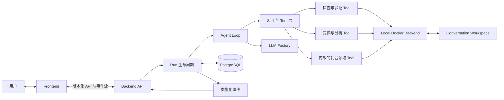

# OmniCell-Agent 架构设计

## 文档控制

| 字段 | 内容 |
| --- | --- |
| 文档状态 | 生效中的架构基线 |
| 所在分支 | `codex/agent-loop-frontend-redesign` |
| 当前阶段 | Phase 18：Tool、Skill 与提示词专业化/泛化调优，已完成 |
| 最近更新 | 2026-07-25 |
| 适用范围 | 单机科研原型架构重构 |

本文档是 OmniCell-Agent 本轮重构的唯一架构设计基线，用于约束系统边界、职责划分、实施顺序与完成标准。本文档有意避免类、函数、接口地址等代码级设计，使具体实现可以在不偏离系统架构的前提下演进。

本项目定位为研究生毕业设计的单机科研原型。架构优先服务于科学能力保留、实验可复现、结构清晰和本地完整演示；本文出现的隔离、恢复与校验边界不代表生产级 SLA，也不应继续外推为复杂的平台工程。

每完成一个实施阶段，必须在同一次变更中更新本文档的进度台账。只有该阶段声明的证据门槛全部通过，才能将其标记为“已完成”。

## 1. 建设目标

OmniCell-Agent 将从以固定工作流为主的应用，演进为保留成熟单细胞分析能力的 Agent 产品。

目标系统采用 `backend + frontend` monorepo，包含：

- 一个小而通用的 Agent Loop，负责理解目标、选择能力、迭代执行和判断完成；
- 以科学目标、输入输出与可验证前置条件组织领域 Skill 和 Tool，不再以历史 DAG 名称组织 Agent 可见能力；
- 一个隔离的数据与代码执行环境 Local Docker Backend；
- 基于 PostgreSQL 的 conversation、run、event、artifact 与 LangGraph checkpoint 持久化；
- 基于逻辑别名的、与模型供应商解耦的 LLM Factory；
- 一套由 backend 与 frontend 共同遵守的类型化流式事件契约；
- 一个面向 conversation 的 Web 界面，用于发起、观察、审核、恢复和继续分析任务。

## 2. 架构原则

### 2.1 保留科学行为，不保留历史能力分类

历史 Graph A 与 Graph B 中已经验证的单细胞分析、受控代码执行与修复、cluster 注释、验证、评分、一致性处理和报告行为必须保留，但其图名、节点名、固定入口和能力分组不再属于产品语义。Agent、Skill、Tool、事件和 frontend 只使用面向科学目标的名称与契约；历史子图可以作为过渡期内部实现，不能继续决定公开能力边界。

### 2.2 分离编排与执行

Agent Loop 负责决定使用哪项能力以及任务是否应继续；领域 Tool 与内聚复合能力负责完成已知的生物分析目标；Docker Backend 负责提供隔离的执行环境。三者职责必须分离。

### 2.3 通过稳定能力边界调用

Agent 通过类型明确的 Skill 与 Tool 使用领域能力，而不依赖内部引擎节点。公开 Tool 按可独立表达和验收的科学目标划分；需要内聚反馈循环的目标以复合 Capability 暴露，但不把内部拓扑提升为产品分类。

### 2.4 大型科学数据不进入控制状态

Agent 与工作流的 checkpoint 只保存轻量控制信息和资源引用。数据集、AnnData 对象、图片、表格、生成文件及大型执行输出应保存在 conversation workspace 与 artifact 层。

### 2.5 生命周期必须可观察、可恢复

每个 run 都具有明确的开始、顺序事件流、终态、checkpoint 身份和 artifact 集合。取消、中断、重连和人工审核属于运行生命周期状态，而不是普通的传输异常。

### 2.6 按角色配置模型

领域代码只引用逻辑 LLM 角色，不直接依赖供应商或具体模型名。供应商凭据、模型选择、流式行为和能力约束由统一工厂解析。

### 2.7 跨端共享契约，不共享内部模型

Backend 与 frontend 共享版本化的 API 和事件契约。LangGraph 内部状态、数据库行结构和 frontend store 结构均不属于公共契约。

### 2.8 进度是架构治理的一部分

实施进度、完成证据、阻塞条件和架构决策统一记录在本文档中。代码已经完成但没有同步更新进度，仍视为该阶段未完成。

### 2.9 设计文档统一使用中文

本项目新增或更新的架构、设计和进度类文档必须以中文为主体，仅保留必要的英文技术标识、协议名、文件名和代码标识符。

## 3. 范围与非目标

### 本轮范围

- 将仓库重构为 `backend/` 与 `frontend/` 主体的 monorepo。
- 将历史分析与注释流程中的科学行为迁移到统一 Skill/Tool 能力体系。
- 建设 Agent Loop 与完整 run 生命周期。
- 建设 Local Docker Backend。
- 建设 PostgreSQL 持久化与 LangGraph checkpointer。
- 建设 LLM provider、alias 与 factory 抽象。
- 建设类型化事件流与 frontend 产品界面。
- 建设核心能力保留、故障恢复和端到端验证体系。

### 非目标

- 不因移除历史 DAG 分类而无证据地改变已经验证的科学算法、反馈循环或聚合语义。
- 不允许 LLM 用不受约束的代码生成替代确定性生物分析操作。
- 不整体复制 Agnes Core 中与本项目无关的多租户、计费、服务发现或 marketplace 能力。
- 不建设多租户鉴权、高可用集群、分布式调度、Kubernetes、完整监控告警或生产发布流水线；本地单机可诊断、可恢复和可复现即可。
- 不把大型科学对象放入 checkpoint 或事件 payload。
- 不让浏览器承担权威 run 状态。
- 不兼容旧版本的模块路径、类名、函数名、CLI、API、历史 DAG 名称或固定编排入口；代表性基线只保护核心领域能力与科学行为。
- 本架构目标不包含生产部署、外部发布、远程 push、PR 或破坏性历史修改。

## 4. 系统全景


```mermaid
flowchart LR
    User["用户"] <--> Frontend["Frontend"]
    Frontend <-->|"版本化 API 与事件流"| API["Backend API"]
    API --> Lifecycle["Run 生命周期"]
    Lifecycle --> Agent["Agent Loop"]
    Agent --> Capabilities["Skill 与 Tool 层"]
    Capabilities --> Inspect["检查与验证 Tool"]
    Capabilities --> Transform["变换与分析 Tool"]
    Capabilities --> Composite["内聚的复合领域 Tool"]
    Inspect --> Runtime["Local Docker Backend"]
    Transform --> Runtime
    Composite --> Runtime
    Agent --> LLM["LLM Factory"]
    Lifecycle <--> PG[("PostgreSQL")]
    Runtime <--> Workspace["Conversation Workspace"]
    Lifecycle --> Events["类型化事件"]
    Events --> API
```

## 5. Monorepo 边界

```text
OmniCell-Agent/
├── backend/       Python 服务、Agent runtime、领域能力与持久化
├── frontend/      React 应用与客户端事件投影
├── contracts/     Backend 与 frontend 共用的版本化契约
├── infra/         本地开发拓扑与运行环境配置
├── scripts/       仓库级开发和验证流程
└── ARCHITECTURE.md
```

### Backend 职责

Backend 负责 conversation、run、Agent 和工作流执行、Docker 生命周期、模型选择、持久化、artifact 以及权威事件流。

### Frontend 职责

Frontend 负责用户交互、服务端事件的本地投影、可视化、审核操作和重连行为。Frontend 不得根据本地 UI 状态自行推断权威完成状态。

### Contracts 职责

Contracts 定义公共请求、响应、事件、错误、审核与 artifact 引用。契约变更必须版本化，并同时校验 backend 与 frontend 的兼容性。

### Infra 职责

Infra 定义本地 PostgreSQL、backend/frontend 开发拓扑、Docker 执行前置条件和环境边界，不承载产品领域逻辑。

本地开发默认使用 OrbStack 提供 Docker daemon。PostgreSQL 开发与 migration 验证使用本机已有 PostgreSQL 镜像启动隔离实例。这些依赖都必须可以通过配置替换，产品组件不得依赖 OrbStack 私有行为。

## 6. Backend 架构

### 6.1 API 边界

API 提供 conversation、run、history、review、artifact、cancel 和事件续传能力。初始传输可以采用 REST 与 Server-Sent Events，但领域事件模型必须与传输方式解耦。

REST 负责命令和资源查询，SSE 负责按游标重放并跟随事件。SSE 连接不是 run 所有者；断线后 run 继续执行，客户端使用最后确认的持久化 sequence 恢复。高频模型增量可以作为不承诺重放的瞬态通知，但所有会改变产品状态的事实都必须先进入持久化事件日志。

### 6.2 Run 生命周期

Run 生命周期是 Agent 执行外围的权威协调者，负责建立身份与上下文、持久化请求、发出有序事件、调用执行图、处理取消或中断、记录终态并保证收尾完成。

客户端断开连接不等价于取消 run；取消必须是独立且明确的命令。

Run 生命周期是顶层 Agent 的唯一公开执行入口。它在调用图之前持久化 run 与启动事件，在调用图之后以取消安全的方式完成终态事件、artifact 登记和资源收尾；不得通过直接调用 compiled graph 绕过这些步骤。进程内取消句柄只负责向当前执行传播命令，PostgreSQL 中的 run 状态与事件才是跨进程权威事实。

应用重启后恢复处于非终态的 run 时，先对账事件、run 状态与 checkpoint，再决定继续、保持人工审核等待或收敛为失败；不得仅凭进程内任务是否存在判断运行结果。应用事件事务与 checkpoint 写入继续采用可恢复的最终一致性，不引入伪造的跨连接原子性。

多 worker 场景使用持久化 lease 与递增 attempt 作为执行所有权 fence。Heartbeat 失败时当前执行必须先停止模型与能力运行，再收敛或交还恢复；取消先写入命令事实，由有效 owner 完成传播与资源收尾，非 owner 不能在有效 lease 期间提前宣告终态。人工审核决定同样只能原子地产生一个权威解决事实。

同步领域能力必须运行在可终止的隔离边界中，不得把线程 Future 的取消当作执行已经停止。父进程继续拥有 Agent、checkpoint、事件、重试和 attempt fence；隔离执行只接收有界数据，并在取消、heartbeat 失败或父进程失联时先停止完整进程组和精确归属的 runtime，再允许当前 owner 释放 lease 或写入终态。隔离执行的存活续期只能来自已成功提交的数据库 heartbeat，不能由独立的本地计时器自行续租。

数据库 lease 可以在清理前声明执行所有权，但 `run.started` 与对应状态转换必须等到 durable runtime 清理门禁通过后，再由当前 attempt fence 原子提交。清理未决时，首次执行和审核恢复分别保持原有的 `pending` 与 `review_required` 语义，使下一任 owner 仍能选择正确的 start 或 resume 路径；取消和进程关闭也不能吞掉清理门禁异常后提前写终态或释放 lease。若 owner 在 `run.started` 后、首个当前 run checkpoint 或审核决定应用前失联，恢复端必须同时对账 checkpoint state 中的 run identity 与已解决 review 的 checkpoint anchor，区分重新 start、重放 resume 和正常 continue，不能仅凭 conversation thread 上存在 checkpoint 推断当前 run 已经开始。

### 6.3 Agent Loop

顶层 Agent Loop 保持小而通用，只负责构建上下文、调用模型、执行所选能力、吸收结果以及判断用户目标是否完成。

本轮不保留现有 Agent Loop 的内部状态结构、节点拓扑、类名、注册接口或调度机制兼容性。实现可以完全替换，只要新的组合根继续服从 run 生命周期、artifact 安全边界和公共事件契约，并通过代表性基线证明核心科研行为未被削弱。

Loop 采用可复用的 LangGraph“推理—Tool 执行—再推理”骨架。核心图只认识消息、Tool 调用、任务投影、预算、取消、审核与终止状态，不认识任何历史 DAG 名称、单细胞数据、marker contract 或具体 artifact 类型。模型、系统指引、运行上下文、Skill Registry、Tool Registry、Tool policy、执行适配器和事件观察器均由组合根注入；领域能力的增减不得要求修改核心图拓扑。

参考 Agnes Core 的稳定机制，模型调用前后采用有序 hook pipeline 装配当前 turn 的消息视图、Skill 方法上下文、计划 backpressure、格式修复和完成约束；hook 只影响当前模型视图或返回明确状态更新，不得隐式修改权威 artifact 与 run 生命周期。上下文压缩作为可选 seam 接入核心图，不在领域 Tool 中自行裁剪历史。

控制类 Tool、检查类 Tool、科学变换 Tool 与内聚的复合 Tool 通过统一的模型可见定义和执行分派进入 Loop。控制类 Tool 可以产生受约束的状态更新或终止结果，领域 Tool 只能通过注册的执行适配器返回结构化结果。Loop 不根据 Tool 名称硬编码领域分支，也不复制 Tool 内部流程。

Agent 必须根据目标复杂度动态选择最小充分路径：稳定、低风险且无需额外方法上下文即可可靠回答的概念问题直接完成回复；问题命中可用 Skill 摘要中的领域术语或方法，且答案依赖其操作定义、适用条件、统计假设、证据边界、组合规则或专业验证标准时，先按需加载相应 Skill，再基于方法上下文直接回答或选择后续 Tool，答复篇幅不是是否加载的判断依据；只需读取或校验局部事实时调用检查 Tool；只需完成一个明确科研操作时调用对应领域 Tool；包含多个相互依赖、可分别验证步骤的复合目标应先建立显式计划，再按结果组合 Tool 与 Skill。加载 Skill 只代表补充本 run 的方法上下文，不自动构成执行授权，也不要求随后调用领域 Tool；用户只要求解释时不得擅自读取数据或执行分析。计划只描述用户目标、依赖与验收证据，不展开任何内部工作流节点。

用户显式选择的输入 artifact 必须在 run 创建时完成 ownership 校验，并以有界、权威的引用描述进入 Agent 上下文。Agent 不得猜测 artifact identity；恢复时从持久化 run 请求重建同一选择集，同时允许本 run 已声明的输出继续参与后续能力组合。

Conversation thread 可以保留对用户有意义的 Human、Assistant 与 Tool 对话历史，但每个新 run 必须重置终态、预算计数和完成判断等 run-scoped state。当前 run 选中的输入 artifact 只作为执行期动态系统上下文注入，不进入跨 run 持久消息，避免旧数据选择污染后续目标。持久化 AIMessage 的身份必须包含当前 `run_id`，不能只由 run-scoped turn 和消息内容派生，否则连续 run 的相同调用会被消息 reducer 错误合并。

Agent Loop 统一约束 turn、时间和模型预算，执行 Tool policy，防止 pending task 被过早结束，并管理人工审核边界。历史内部工作流逻辑不进入顶层循环。

循环采用小型的“推理—能力执行—再推理”结构。模型通过 `agent_primary` 角色 alias 获取，Capability Registry 是唯一领域 Tool 来源；Skill 指引进入上下文，但不与 handler 生命周期耦合。每条用户输入创建一个 Run，但不自动创建代表整条输入的根 Task；Task 只表达显式计划步骤或实际能力调用，不能把普通问答伪装成 `agent_goal`。

直接回复、Tool、Skill 与多步骤计划共用同一预算和完成判断。模型返回非空 Assistant 文本且没有 Tool 调用时，只要当前不存在未完成的显式计划，Loop 就应将其视为面向用户的最终回复并完成 Run；这一规则同时覆盖无需执行的普通问答和单 Tool 结果后的自然总结。空回复继续采用有限提醒和停滞保护；存在未完成显式计划时，普通文本只能作为阶段性说明，Loop 必须提醒模型继续执行或更新计划，不能提前完成。`finish_task` 只保留为显式、结构化的完成方式，不再是普通问答或单 Tool 路径的必经步骤。

顶层 Agent 使用统一响应契约约束所有最终回复，而不是为单个问题追加局部文风规则。安全边界、科学真实性和权威 Tool 契约不可被覆盖；在此前提下，当前用户对语言、篇幅、受众、格式、重点和排除项的明确要求优先于默认表达偏好。没有明确要求时，Agent 采用“最小充分表达”：先给结论，只补充理解或决策所必需的解释、证据、限制和下一步，不把模型可生成的内容量当作回答深度。

响应深度与结构必须随任务语义调整，而不是固定使用长文模板。普通概念问答默认使用短段落，不主动增加多级标题、表格、重复总结或大量例子；教程、报告、系统对比或用户明确要求详细时才扩展。执行类任务先陈述完成结果，再给关键证据、已登记 artifact 和真正影响判断的限制；澄清只提出当前继续工作所必需的问题。全局响应契约负责表达优先级、证据分层和通用认识论边界，领域 Skill 负责具体方法事实、适用条件与验证规则；前者不得演变为领域知识库，后者不能覆盖用户当前表达要求。

科学表达必须区分通用知识、当前数据的直接观测、基于证据的推断与建议，不能把一般经验写成当前数据结论，也不能用绝对化措辞掩盖不确定性。类比只在能显著降低理解成本时使用，必须简短、贴合科学关系且不制造新的错误印象；禁止猎奇、血腥、贬损或喧宾夺主的比喻。最终回复不披露模型思维链、内部控制过程或无助于用户目标的实现细节。

响应契约主要通过系统提示词执行，不在输出后做机械截断或重写，避免破坏科学语义、Markdown 与 artifact 引用。确定性验证负责约束提示词结构、优先级和与动态路由的兼容性；真实模型测试只作为跨模型行为观察，不能替代可复现门槛。

显式计划只用于复合目标，采用有界步骤数和持久化 task 事件展示；简单问答或单能力任务不得为了形式完整而强制建计划。计划步骤完成必须绑定当前 run 内已经验证的 Tool 结果、artifact 或受控事实，不能仅依赖模型自行声明状态。计划可以修订，但旧的未完成步骤必须被明确取消，不能与新计划同时保留为活跃事实。

Tool 结果统一返回模型可理解的受控 outcome。失败至少区分稳定 `error_code`、是否可重试和恢复建议，三者必须与该结果写入状态后的真实恢复动作一致；相同 Tool、等价参数与相同失败重复出现时，Loop 必须有限阻断重复调用并要求重新选择路径。模型一次返回多个 Tool call 时，Loop 在持久化前按剩余 Tool 预算做有界规范化，保证 canonical Tool call ID 非空、有界、批内唯一，并让每个持久化 call 恰有一个结构化拒绝结果，使 checkpoint 消息历史始终满足 Tool 协议配对。最终完成应声明完成依据、关键 artifact 与未解决限制，并由 Loop 对当前计划和 run 内证据做结构校验。

领域 Tool 成功后由 Loop 将本次调用登记为稳定、模型可见的 evidence handle，并优先自动对账当前唯一活动计划步骤：步骤声明 `capability_hint` 时必须精确匹配，未声明时本次成功 Tool 视为模型对当前活动步骤选择的证据。自动对账与 `task.updated` 必须和返回 Agent 的状态更新一致，后续步骤只在依赖满足后激活；手工更新仍可用于失败、取消或特殊证据补充，但不能再要求模型猜测 checkpoint 内部 Tool call identity、invocation 路径 token 或 workspace URI。

Assistant 文本只有在通过当前计划与完成门禁后，才能作为 `message.completed` 进入公共事件流；被 backpressure 拒绝的候选回复只保留在内部 checkpoint，不得先在 frontend 中伪装为最终答复。模型可见 Tool 结果只暴露稳定 artifact identity、有界 metadata 与领域摘要，不暴露 `workspace://` URI 或宿主路径；面向用户的最终文本同样不得包含内部资源定位符。

turn、模型调用、Tool 调用和墙钟时间均采用显式预算。预算耗尽、取消、人工审核、可重试错误与不可重试错误是不同状态，必须走确定的路由并发出对应事件。Tool policy 在执行前做授权判断；需要人工确认的调用保存可恢复的审核状态和 checkpoint，审核决定通过独立命令恢复，不把等待误记为失败或完成。

### 6.4 Skill 与 Tool 层

能力层按科学效果而不是历史执行拓扑组织：

- 检查与验证能力：读取 dataset、marker table、annotation 与 artifact 的有界事实；
- 科学变换与分析能力：完成能够独立验收的数据处理、统计分析和可视化目标；
- 内聚的复合能力：内部存在并发、验证或反馈循环，但对用户仍表现为一个明确科学目标；
- 受控扩展能力：仅在标准 Tool 无法满足目标时执行有界的探索性分析。

Skill 与 Tool 采用正交注册。Skill 描述意图、适用条件、方法选择、组合方式和验证规则；Tool 提供类型化执行能力；Recipe 是 Tool 内部复用的确定性实现，不再称为 Agent-facing Skill。Skill 可以引用一个或多个 Tool，同一 Tool 也可以被多个 Skill 引用，但 Skill 不拥有 Tool 的 handler 生命周期，Tool 也不反向绑定唯一 Skill。启动期只校验名称与类型契约、Skill 引用的 Tool 已注册，以及 required Skill 与 Tool 声明互相一致；科学前置条件和输入输出 artifact 契约由 Tool 的类型化请求、执行适配器和代表性能力测试验证，不宣称当前 Skill 元数据可以自动判定跨能力语义兼容性。

Skill 采用渐进式披露。Agent 初始上下文只包含名称与简短触发说明；当问题命中 Skill 摘要中的领域术语或方法，且答案依赖其操作定义、适用条件、统计假设、证据边界、组合规则或验证标准时，Agent 通过 `load_skill` 加载正文，并只在必要时继续加载 reference 或 example。是否加载取决于领域方法风险，而不是用户要求的答复长短。Skill 正文既可以指导后续 Tool 选择，也可以单独作为本 run 的方法上下文支持最终回复；加载本身不要求执行任何领域 Tool。只有名称、版本和内容哈希均与当前目录一致的正文 `body` 可以满足 `required_skills` 并解锁对应 Tool；reference/example 必须在同版本正文之后加载，不能独立解锁 Tool。模型可见 Tool view、`load_skill` 与领域 Tool 执行门禁均重新验证该身份，直接从 checkpoint 恢复到 pending tools 节点时也不能跳过；任一已加载正文或子资源失效时，本次 Tool 在执行或加载前结构化拒绝，把仍可重建的资源集合写回 checkpoint，并要求下一轮重新加载。加载结果以名称、版本和资源标识进入 run-scoped 方法上下文，正文只在当前模型视图中重建，不作为普通 ToolMessage 永久堆叠。每次新增资源必须先验证候选聚合上下文仍可按同一标识重建且没有超过上限，再写入 checkpoint 并发出 completed 事件。稳定、低风险且不依赖领域方法边界的简单概念回复，以及单一、契约充分的 Tool 调用，不得被强制加载完整 Skill。

Tool 的模型 schema 描述“能够做什么”，独立的行为提示描述“何时调用、何时不调用、需要哪些前置条件以及如何吸收结果”。行为提示是 Agent 选择能力的主要引导面，但不能替代运行时 Tool policy、输入校验、artifact ownership 或执行隔离。

Agent-facing Skill 与确定性 Recipe 必须在语义和注册机制上分离。前者服务于顶层 Agent 的能力发现、方法选择和 Tool 组合；后者保存经过验证的执行配方。Tool 可以复用 Recipe，但不能让主 Agent 直接读取脚本路径、依赖跨 Tool 的有状态 Python 局部变量或绕过 artifact 契约。

能力注册表采用应用实例拥有的组合边界，将 Skill 元数据、可执行 Tool handler 与 Loop 控制 Tool 分开。所有领域调用接收类型化请求并返回有界结果、诊断摘要与 artifact 引用，不暴露宿主绝对路径、LangGraph 内部状态、Docker 私有状态或大型科学对象。Artifact 引用由 conversation-scoped adapter 解析和生成，数据库登记由外围 run 生命周期统一完成。

每次隔离调用的输出先进入 invocation-scoped 非权威命名空间。只有当前 worker 与 attempt fence 仍有效时，外围生命周期才能把返回引用登记为权威 artifact；取消、旧 owner、worker crash 或未完成调用留下的残片不得被后续全 workspace 差集扫描误发布。

首批 Agent-facing 领域 Skill 按方法拆分为单细胞预处理、聚类与 marker 分析、细胞类型注释、科研可视化和探索性分析。Skill 不代表固定流水线；Agent 根据用户目标和 artifact 状态组合所需能力。空间转录组 Skill 只有在对应 Tool 具备名称一致的科学语义、明确输入契约和代表性基线后才进入公共目录。

公开原子 Tool 以用户可单独表达和验收的科研目标为边界。首批开放质量控制与过滤、归一化、PCA 与聚类、marker gene 提取和 PCA 可视化；这些能力可以在不改写现有科学算法的情况下建立独立 artifact 契约。批次校正、轨迹推断、快速细胞类型注释、空间结构域识别和空间插值保留为候选，必须先消除吞异常或隐式成功、补齐关键科学参数和前置条件，并解决能力名称与实际算法不一致等问题，不能仅因内部脚本存在就注册为公共 Tool。

旧的“完整分析”入口不再作为默认万能 Tool。标准分析目标由主 Agent 组合明确的领域 Tool；只有标准能力无法覆盖的非标目标才进入受控探索性分析。Cluster fan-out、annotation、validation、scoring、可选 improvement、一致性处理和报告属于一个内聚的细胞注释复合能力，其内部节点与历史图名不进入顶层公共 Tool 面。

原子 Tool 必须声明接受的 artifact 类型、科学前置条件、参数边界和产物类型。会改变数据状态的操作必须生成新的版本化 artifact，不得原位改写输入；多个原子 Tool 通过 ArtifactRef 衔接，不依赖跨 Tool 调用保留的容器内局部变量。每项能力在公开前必须具备确定性输入输出契约和代表性基线。

### 6.5 探索性分析内部引擎

标准 Tool 无法覆盖的开放式单细胞目标可以进入受控探索性分析内部引擎。该引擎可以复用历史分析流程中已经验证的上下文解析、代码生成、隔离执行、评估与有限修复行为，但不得再次承担顶层通用规划，也不得把 Recipe 名、内部节点或持久 Python 局部状态暴露给主 Agent。

迁移时必须区分“保持科学行为的运行方式变化”与“有意进行的算法改进”。只要求 QC、归一化、聚类、marker 或绘图等标准目标时不得调用该扩展能力。

### 6.6 细胞类型注释内部引擎

细胞类型注释复合能力继续保留 cluster 级 annotation、validation、scoring、可选 improvement、跨 cluster 一致性处理和结果报告。

Cluster 级并发和内部路由由注释引擎自身管理。顶层 Agent 只观察有业务意义的进度与结果，不微观控制内部节点，也不使用历史 DAG 名称描述该能力。

注释能力的类型化结果除 ArtifactRef 与计数外，还必须返回有界的 cluster 级权威摘要，至少包含 cluster identity、最终细胞类型、受控置信度、flags 与人工复核状态。顶层 Agent 的结果解释应以该摘要为准，不能根据通用 PBMC 常识猜测 artifact 内标签；完整 reasoning chain 与 marker evidence 继续保存在 artifact 中，按需预览而不进入无界模型上下文。

### 6.7 Local Docker Backend

Local Docker Backend 是科学变换、探索性分析和代码类 Tool 的标准执行环境，提供：

- lazy、异步的容器生命周期；
- 挂载到可替换容器中的持久化 conversation workspace；
- 对路径、命令、环境、网络、CPU、内存和时间的约束；
- 有上限的输出与 artifact 传输；
- 协作式取消以及可靠的进程和容器回收；
- 足够支撑诊断与复现的 runtime metadata；
- 可配置且可由 digest 标识的 runtime profile。

Conversation 数据的生命周期长于容器。空闲或失败容器可以基于同一 workspace 重建，不得丢失已经声明的 artifact。

Runtime 只创建并管理自身拥有的容器，不附着到未验证的外部容器。默认禁止网络，只有明确的 Tool policy 才能选择受控网络 profile；普通命令采用直接参数执行，shell 与网络都必须由 profile 和 Tool policy 双重授权。宿主环境中的 secret 不进入执行容器，执行时间、进程、资源、输入输出与文件传输均具有硬边界。取消与异常收尾必须同时回收宿主 Docker CLI 进程和容器内本次执行派生的进程。

Capability 隔离进程与 Docker 容器使用不可复用的调用身份建立精确 ownership。隔离进程不得以 conversation workspace 作为解释器启动目录，避免 workspace 内容进入宿主模块解析边界。面向用户目标的实际 runtime 命令、exit code 与 stdout/stderr 可以形成公开执行转录，但必须在独立的非控制面通道中有界采集；宿主绝对路径、凭据、环境变量值和 backend 内部控制命令必须脱敏或不进入转录，未知异常仍只进入服务端诊断日志。

Runtime claim 持久保存在 conversation workspace 之外、由 backend 独占且不挂载给容器的本地控制目录，使父进程硬退出后的恢复流程仍能定位候选容器。Claim 不能单独证明 ownership；删除前仍需通过 Docker 控制面复验调用身份。Capability 容器只读挂载 conversation workspace，仅把当前 invocation 输出目录作为独立可写挂载，并对文件数、单文件和总字节设置适合本地科研任务的有限边界；回收完成后同时清理对应的非权威输出空间。

执行控制面与不可信代码可写的输出数据面必须分离。成功、失败与完成判断只能建立在不可信代码无法伪造的 runtime 生命周期事实上；任何适配层都不得把同一被执行进程可写的 stdout 协议帧当作可信完成信号。

探索性分析与细胞注释内部引擎的编排、状态流转和 LLM 调用保留在 backend 进程中；只有需要隔离的数据、代码和文件操作进入 Docker。若未来需要把完整内部引擎迁入容器，必须先形成新的架构决策并重新验证生命周期边界。

### 6.8 LLM Factory

LLM Factory 将逻辑 alias 解析为 provider、model 与运行参数。主推理、快速路由、代码生成、annotation、validation、summary 和 vision 等角色可以使用不同 alias。

Factory 统一负责 provider 注册、配置校验、密钥安全展示、能力兼容性、可观测性和测试替身。领域组件只依赖 alias 与统一 Chat Model 契约。

Factory 与 provider registry 采用可实例化边界，由应用组合根负责配置和生命周期；进程级 facade 只按角色 alias 委托统一 Factory。角色 alias 必须声明最低能力并在启动期校验，配置不完整或能力不匹配时拒绝进入部分可用状态。

## 7. 持久化与状态归属

PostgreSQL 是元数据与控制状态的持久化系统；filesystem 或对象式 workspace 是大型 artifact 的持久化系统。

### 应用持久化

应用记录包含 conversation、run、有序事件、dataset 引用、artifact、人工审核，以及 history 与运行查询需要的投影数据。

Conversation 标题属于 backend 权威资源 metadata。空 conversation 可以由 frontend 显示临时占位；首条有效用户目标触发一次简洁标题总结，并在 Run 创建响应返回前持久化。生产组合根通过 `summary` LLM 角色生成标题，provider 超时、失败或返回非法内容时使用有界的确定性标题兜底；标题生成失败不得阻止 Run 创建或改变 Run 终态。自动标题只允许替换空值或项目保留的初始占位，不得覆盖已经明确设置的标题，也不应在后续多轮中无故抖动。

应用表由项目 migration 唯一管理；LangGraph checkpoint 表由 saver 自身的 migration 唯一管理。两者可以部署在同一 PostgreSQL 实例，但必须使用不同 schema，保持逻辑隔离、独立连接池和清晰的 schema ownership，任何一侧都不得重复管理另一侧的表。

### LangGraph Checkpointer

Checkpointer 使用 PostgreSQL 和受管理的异步连接池。Conversation 身份对应顶层 thread；顶层 Agent 使用 LangGraph 根 namespace，嵌套工作流使用 LangGraph 管理并向下传播的 namespace。独立组件只有在绕过 compiled graph、直接使用 saver 时，才使用自身拥有的显式 namespace。

Checkpoint 保留策略服务于运行恢复，不承担科学审计职责。它应保留当前恢复点、编辑或重新生成锚点、人工审核中断点和声明的工作流边界，同时避免无界增长。Retention 只能在 run 进入终态并经过宽限期后执行；孤儿数据清理只能针对本次被删除 checkpoint 已声明的版本，不能扫描并删除活跃写入尚未完成关联的数据。

Conversation 身份构成 thread identity。Agent 占用根 namespace，嵌套的复合能力或内部引擎依靠框架管理的 namespace 隔离；不得把顶层调用传入的自定义 namespace 当作 compiled graph 的隔离保证。保留策略由最新恢复点、显式保护锚点和终态宽限共同决定，不使用脱离产品语义的全局固定数量。

Checkpoint 的大小与类型约束覆盖完整 saver 写入面，包括状态、metadata 与中间 writes。数据库运行日志只允许记录去除用户信息、密码和 query 参数后的目标位置，不输出原始 DSN。

### Event Log

事件采用 append-oriented 方式记录，在单个 run 内有明确顺序，并支持幂等重放。Event Log 用于 history 重建、断线恢复、诊断和 frontend 投影。大型内容只通过 artifact 引用表达。

单个 run 的 sequence 必须由数据库原子分配，不能依赖时间戳或无锁读取最大值。Run 状态变化与对应生命周期事件在同一应用事务中提交；应用事务与 checkpoint 写入不宣称跨连接原子性，恢复流程通过持久化身份和事件进行对账。

公共事件使用版本化 envelope，至少携带 event identity、run identity、conversation identity、事件类型、sequence、发生时间和有界 payload。持久化事件分为 run 生命周期、Agent turn、task、Tool/workflow、review、artifact、预算与错误等稳定事实；模型 token delta、传输层 heartbeat 等瞬态通知不得驱动不可恢复的权威 UI 状态，面向用户解释长任务状态的 capability progress 则属于可重放事实。

重放只返回已提交事件并严格按 sequence 排序。实时跟随必须先完成指定游标后的数据库重放，再订阅新提交事件；订阅切换期间出现的事件仍通过下一轮数据库追赶补齐，因此不依赖单进程内消息队列提供可靠交付。客户端 reducer 以 event identity 和 sequence 幂等应用。

### Workspace 与 Artifact

每个 conversation 拥有隔离 workspace，其中保存 dataset、working file、已声明 artifact 和有上限的执行日志。Artifact 在 PostgreSQL 中具有稳定身份和 metadata，其大型 payload 不进入 checkpoint 与事件表。

## 8. Frontend 架构

Frontend 以 conversation 为中心，以事件驱动状态变化，核心体验包括：

- conversation 与 dataset 导航；
- chat 与人工审核交互；
- 结构化计划、Capability 和 runtime 进度；
- task 与 run 状态；
- artifact 预览和下载；
- reconnect、resume 与明确 cancel；
- 可选的诊断事件视图。

客户端状态按职责拆分，而不是累积到单一全局 store。服务端事件通过确定性、幂等的 reducer 生成 UI 投影。高频流式更新可以按渲染帧合并，但不能改变事件顺序。

Frontend 除跟随当前 run 的 SSE 外，还应低频对账当前 conversation 的 run history，使由 API、实验脚本或其他本地入口创建的新 run 能被自动发现并切换到相应事件流。事件诊断视图展示类型化 envelope、定位字段和公开执行转录；仍不得渲染模型思维链、原始供应商响应、宿主绝对路径、环境变量值、内部 checkpoint 或执行栈。

Skill、Tool、Backend 与 artifact 展示使用 renderer registry，并提供安全的通用 fallback。Backend 内部可以继续使用 `capability.*` 事件表达领域 Tool handler 的执行生命周期，但 frontend 不得把“Capability/能力”继续呈现为独立的 Agent 行为分类；它必须与对应的 Agent-facing Tool 调用合并为一次 Tool 活动。检查、变换、分析、注释、可视化和探索 Tool 可以拥有领域化的过程和结果视图，但必须继续遵守统一事件契约。

Conversation 主时间线不是当前 run 的临时视图。Frontend 进入或刷新 conversation 时，必须先分页读取 run history，再重放每个 run 的持久化事件并合成为 conversation 级投影；已经终态的历史 run 只需重放，当前活跃 run 在重放后继续跟随 SSE。合并顺序由服务端 run 时间与各 run 内 sequence 决定，不依赖浏览器接收时间或本地缓存。

面向用户的活动流分为可恢复事实和瞬态增量。会影响历史解释、任务状态、能力阶段、runtime 执行结果、公开执行转录或 artifact 可见性的事实必须持久化；高频但不改变权威状态的增量可以保持瞬态。Tool 或 workflow 发起的实际容器命令使用容器内逻辑路径表达，允许展示完整 argv、exit code 与有界 stdout/stderr；所有转录都必须携带 `truncated` 与 `redacted` 状态，且不得包含模型思维链、原始供应商响应、宿主绝对路径、凭据、环境变量值或内部执行栈。

主时间线通过 renderer registry 展示 message、plan/task、Skill 加载、Tool 调用、Backend 操作、review、artifact 与 run 终态。Skill、Tool 与 Backend 卡片必须使用一致的信息层级，直接回答“正在做什么、经历了什么过程、结果是什么”；不得用“结构化领域能力”“能力调用已返回”等内部抽象或无信息量翻译代替真实动作与结果。右侧 Inspector 保留为诊断和筛选入口，但不能成为观察 Agent 行为或查看产物的唯一方式。已经通过当前版本 schema 校验、但尚无专用 renderer 的已知事件与未知 artifact 使用安全 fallback；未知 schema/type、身份冲突或 sequence 非法仍须 fail-closed 并停止当前投影。

Inspector 必须显式展示当前作用域，默认只统计和展示当前 Run；切换到 conversation 作用域时，每项记录都携带 Run identity，不能把多个 Run 中重复的 sequence 混成单一运行轨迹。Run 失败时，尚未收到终态事实的计划步骤只能投影为“未收敛/中断”，不能伪造为步骤自身执行失败。Runtime code/stdout 默认折叠，只有执行中输出或失败 stderr 自动展开；`cluster_annotations` 使用领域表格呈现最终类型、分数、flags 与复核状态，详细证据保持折叠。

Skill 加载与 runtime command 若因取消或执行进程异常退出而来不及生成自己的完成事件，Frontend 在应用权威 `run.cancelled` 或 `run.failed` 终态时必须同步收敛仍处于 running 的活动卡片。该收敛只派生 UI 状态，不伪造新的持久化事件；正常路径仍以各自的 completed/failed 事件为事实来源。

Artifact 预览建立在权威 `ArtifactRef` 与 conversation ownership 之上。图片、小型文本、Markdown、JSON、marker table、cluster annotations 和有界表格可以在主时间线中按类型预览；大型 CSV/TSV、dataset 与其他大对象只展示 schema、统计、metadata 或受限样本，不得由浏览器无界读取。只有已经完成 fence 校验并登记为权威 artifact 的内容才能进入预览，invocation-scoped 非权威输出不得被直接展示。

## 9. 主要业务流

### 新建分析任务

用户新建或恢复 conversation，选择数据并提交目标。Backend 创建 run、持久化请求、启动 Agent Loop，并持续发出有序生命周期事件。Agent 根据需要直接回答、加载 Skill、调用原子或复合 Capability，输出转化为 artifact 和后续 turn 的上下文。

### 数据分析到细胞注释

端到端任务中，预处理、聚类与 marker Tool 逐步生成带版本的数据集和 marker table；细胞注释 Capability 消费已声明的 marker table，而不是读取任何上游内部状态。完成后，Agent 可以继续解释、可视化或导出结果。

### 重连与续传

Frontend 使用最近已应用的 sequence 发起重连。Backend 先重放已持久化事件，再继续跟随实时事件。重复收到的事件不得造成 UI 状态重复。

### 取消与人工审核

取消从 run 生命周期传播到当前 Agent、工作流和 Docker Backend，随后完成持久化收尾。人工审核在明确 checkpoint 上暂停，并通过已记录的审核决定恢复执行。

## 10. 科研原型需要的可靠性边界

本节只定义避免实验误写、状态错乱和本地资源残留所需的最小边界，不把本项目扩展为生产运维平台。

- 每个 run 最终都进入持久化终态，或明确保持可恢复状态。
- Tool、复合 Capability、模型、checkpoint 与 backend 身份必须进入诊断上下文。
- Docker 执行与 backend 进程状态隔离，并限制在 conversation workspace 内。
- Secret 仅由配置解析，不得通过 provider 检查接口或事件对外返回。Run、task 与 capability 的公共失败投影只暴露稳定 `error_code`、受控摘要和关联身份；原始异常文本只进入服务端诊断日志。经独立契约标识的 runtime 执行转录不属于异常投影，可以展示有界且已完成路径与凭据处理的 command/stdout/stderr。
- Event payload 与模型上下文不得吸收无界执行输出。
- 复合 Capability 内部修复预算与顶层 Agent 重试预算相互独立。
- 简单的本地 health/readiness 应区分 API、PostgreSQL 与 Docker execution backend，便于演示前快速定位哪项依赖未启动；不建设复杂探针治理或监控系统。
- 模型与 Tool 调用应记录耗时、用量、结果和关联身份，frontend 无需理解内部 trace 结构。

## 11. 重构切换约束

- 机械目录移动不得与有意行为变化混在同一阶段。
- 已验证科学行为改变调用边界之前，必须建立代表性行为基线。
- Backend 与 frontend 并行开发前，必须先冻结公共契约。
- 数据库 schema 变更必须通过 migration，并支持干净环境一键初始化。
- Docker Backend 替换必须验证 cancel、路径约束、资源约束、输出约束和 workspace 连续性。
- 新端到端路径通过核心能力、恢复和产品闭环门槛后，必须删除会绕过新 run 生命周期的旧入口与迁移适配层。
- 不以旧模块路径、旧符号或旧调用协议作为完成门槛；需要延续的行为必须重新落在正式 Skill、Tool、Runtime 或公共契约边界上。

### 核心能力证据分层

历史分析与注释流程的核心科学行为基线分为确定性契约证据、受控模型替身证据和真实模型观察证据。确定性契约用于锁定领域输入输出、关键路由、聚合、评分与 artifact 语义；受控模型替身用于验证结构化模型边界和可复现的内部引擎行为；真实模型结果仅作为可选的分布观察，不作为重构能否合入的唯一门槛。

核心能力基线不冻结旧模块路径、旧符号、工作流内部节点拓扑、提示词全文、并发完成顺序、trace 时间戳等实现细节。未来调用边界发生变化时，必须继续满足前两类可复现证据，并明确报告真实模型尚未覆盖的部分。

## 12. 必须遵循的实施顺序

### Phase 1：机械式 Monorepo 重构

将现有 Python 工程移动到 `backend/`，建立 `frontend/`、`contracts/` 与 `infra/` 边界，并保持当前行为可运行。本阶段不进行领域逻辑重设计。

完成门槛：仓库结构落地，import 与既有测试可以从新的 backend 位置运行，Graph A/B 没有发生有意行为变化。

### Phase 2：Graph A/B 核心能力基线

在改变 Graph A/B 调用方式之前，为两者建立具有代表性、可复现的行为和契约基线。

完成门槛：基线输入、结构化预期输出和比较规则可以执行，并明确区分确定性契约与模型随机性。

### Phase 3：PostgreSQL 持久化基础

引入数据库 migration、应用 repository、run/event/artifact 持久化，以及 PostgreSQL LangGraph checkpointer 生命周期。

完成门槛：干净初始化、并发 checkpoint、恢复、保留策略和关闭流程通过验证，且大型科学对象没有进入 PostgreSQL。

### Phase 4：LLM Factory

引入 provider 注册、逻辑 alias、角色化模型选择、配置校验、能力检查、可观测性和测试 provider，并把直接构造模型的逻辑迁移到 factory 边界后。

完成门槛：Graph A/B 与后续 Agent 可以仅通过配置切换 provider 或 model，不需要修改领域代码。

本阶段通过 factory contract、Graph A/B 接入和测试 provider 证明可替换性；真实 Agent Loop 对 LLM Factory 的接入在 Phase 7 再次验证。

### Phase 5：Local Docker Backend

使用标准 Local Docker Backend 和 conversation workspace 模型替换当前 sandbox。

完成门槛：生命周期、workspace 连续性、路径约束、命令与环境约束、网络策略、资源限制、输出限制、secret 不下发、image digest、取消、清理和 runtime metadata 均通过集成测试。完成该阶段时必须实际连通 OrbStack Docker daemon。

### Phase 6：Graph A/B Skill 与 Tool 化

将 Graph A/B 暴露为高层工作流能力，并在适合 Agent 组合的场景下暴露部分原子领域能力。

完成门槛：完整工作流与选定细粒度调用路径均保持 Phase 2 核心能力基线，并返回类型明确的结果与 artifact。

### Phase 7：Agent Loop 与事件生命周期

在能力层之上引入顶层 Agent Loop、run finalization、类型化事件、task/review 状态、cancel、replay 和 resume。

完成门槛：routing、termination、budget、retry、review、replay、disconnect、cancel 与 recovery 通过契约和集成测试；真实 Agent 使用 LLM Factory；backend API 与流式传输 adapter 已落地，供 frontend 使用的契约完成冻结。

### Phase 8：Frontend 产品闭环

基于已经冻结的契约，建设 conversation、dataset、streaming、Capability 进度、task、review、artifact、reconnect 和 cancel 体验。

完成门槛：frontend 静态检查和关键端到端场景通过，且不依赖 backend 内部状态结构。

### Phase 9：切换与旧入口清理

完成最终核心能力与恢复验证，将唯一受支持入口切换到新产品架构，并删除已经被替代的固定编排、旧符号和 sandbox 迁移入口。

完成门槛：集成后的 backend/frontend 通过最终证据集，独立 Checker 结论绑定到准确快照，并且没有仍在生效但已不受支持的旧路径。

### Phase 10：通用 Agent Loop、渐进式 Skill 与原子 Tool

本阶段在已经完成的产品闭环上收窄顶层 Agent 的领域耦合，并按以下顺序实施：

1. 先冻结 Skill/Tool 正交注册、渐进披露、原子能力边界和最小充分路由规则，同时明确现有注册机制与 Agent Loop 内部框架均不属于兼容面；
2. 将 Loop 收敛为领域无关的 LangGraph 骨架，使模型、上下文、Skill、Tool、policy、执行与观察能力通过组合边界注入；
3. 在不改写既有科学算法的前提下，先为质量控制、归一化、PCA 与聚类、marker gene 提取和 PCA 可视化建立独立、版本化的 ArtifactRef 输入输出契约并注册为原子 Tool；其余候选逐项通过科学契约门槛后再开放；
4. 验证直接回复、只读检查、单原子目标、完整 workflow 与多能力显式计划五类路径，并复核 Graph A/B 核心行为没有退化。

当前进度：

- [x] 完成架构决策、Agnes Core 对照分析和旧机制非兼容边界冻结；
- [x] 完成领域无关 LangGraph Loop、实例级 Tool Registry、Skill 渐进加载与 OmniCell 组合根；
- [x] 完成五个首批原子 Tool 及 invocation-scoped ArtifactRef 适配，真实 OrbStack 环境已串联归一化、PCA/聚类和 marker 提取；
- [x] 完成五类路由、Graph A/B 核心行为、默认后端、PostgreSQL、Local Docker、frontend、隔离 Chromium 与真实产品闭环验证；
- [x] 冻结 tree `3f01388b993881c7ce913c33e8fbbf849d095927` 通过 fresh I1 独立只读 Checker，结论为 PASS，无 P0/P1/P2，独立复跑 126 项。

非阻断限制：`run_pca_clustering` 的“输入应已归一化”当前由 Skill 正文、Tool 行为提示和已验证的原子链顺序共同约束，尚未通过 dataset provenance 或矩阵状态做 fail-closed 判定。当前不引入可能误判的启发式检查；后续若扩展为更自由的模型调度，再以显式预处理 provenance 完成机器可验证前置条件。

完成门槛：Skill 与 Tool 不再是一对一所有权关系；初始上下文只暴露 Skill 摘要并支持按需加载正文及子文档；核心 LangGraph Loop 不含 OmniCell 领域名称或领域路由分支；公开原子 Tool 均能跨调用通过 ArtifactRef 衔接；五类路由和 Graph A/B 代表性核心行为通过确定性验证，最终快照通过独立只读 Checker。

### Phase 11：Conversation Activity、历史恢复与 Artifact 预览

本阶段修复真实多轮冒烟暴露的产品可观察性缺口，并按以下顺序实施：

1. 冻结可恢复活动事实、瞬态增量、公开 runtime 执行转录和 artifact 预览边界；现有 run/event/artifact 权威归属不变；
2. 让 Skill 渐进加载与能力执行在开始、等待、完成和失败期间产生有界、可理解且可重放的活动事实，避免 Agent 的知识加载和长任务执行成为黑盒；
3. 将 frontend 从“只投影最新 run”改为 conversation 级历史恢复，刷新后重建全部 run 的消息、任务、能力、活动和产物；
4. 建立主时间线 renderer registry 与 artifact preview registry，使 Tool/workflow、runtime activity 和可安全预览的中间产物在 conversation 中实时出现；
5. 以真实 React、FastAPI、PostgreSQL、checkpointer 与 SSE 验证多轮执行、运行中刷新、终态刷新、历史重放和预览边界。

当前进度：

- [x] 完成真实四轮冒烟和问题定位：四个 run 均已持久化，但 frontend 只恢复最新 run；Graph B 在单次长能力调用期间缺少中间活动事实；
- [x] 冻结 conversation 级投影、活动事实分层、renderer registry、预览大小边界，以及公开执行转录与敏感信息边界；
- [x] 完成 backend 活动事件与有界执行转录；
- [x] 完成 frontend 历史恢复、会话活动组件和 artifact preview registry；
- [x] 完成跨端契约、前后端测试与真实刷新 E2E；
- [x] 完成最终独立 Checker。

完成门槛：刷新 conversation 后可以恢复全部历史 run；长能力调用持续展示有界活动进度；主时间线实时渲染 Tool/workflow、runtime command/output 和已登记 artifact；支持的中间产物能够安全预览，大型或未知内容使用有界 fallback；公开转录如实标注截断与脱敏状态，并且公共事件与预览不泄露模型思维链、宿主路径、凭据、环境变量值、原始异常或无界执行输出；最终真实产品闭环和独立只读 Checker 均通过。

### Phase 12：Agent 能力语义重构

本阶段移除历史 DAG 对 Agent 能力本体的控制，并参考 Agnes Core 的通用框架机制增强 Loop：

1. 先废止历史 DAG 作为公开 Skill、Tool、事件和 frontend 分类的架构决策，只保留经验证的科学行为基线；
2. 引入统一 Capability、Skill 与 Recipe 语义，补齐科学效果、输入输出 artifact、前置条件、参数和 Skill 关系；
3. 为 Loop 引入有序 hook pipeline、run-scoped Skill 方法上下文、动态 Tool view、重复调用保护和可选上下文压缩 seam；
4. 让计划步骤绑定真实 Tool 结果或 artifact 证据，并让 Tool 失败返回稳定错误分类、可重试性与恢复建议；
5. 将旧完整分析入口收敛为受控探索性分析，将 cluster 注释闭环保留为内聚复合能力，彻底移除 Agent 与 frontend 的历史 DAG 名称；
6. 更新确定性路由、契约、科学行为、frontend 和真实产品闭环验证。

当前进度：

- [x] 完成当前实现审计和 Agnes Core 框架机制对照；
- [x] 冻结新的能力语义与实施顺序；
- [x] 完成统一注册契约与 Skill/Recipe 迁移；
- [x] 完成 Loop hook、计划证据、失败恢复与动态 Tool view；
- [x] 完成领域能力和 frontend 公开语义迁移；
- [x] 完成全量与端到端验证；独立审查发现的计划替换顺序、科学前置条件、Recipe 参数注入、非完成结果证据、Skill 资源身份、失败重试语义、通用 Tool 失败 envelope、Skill 正文解锁门禁、聚合上下文原子加载、多 Tool call checkpoint 配对、通用 stale 执行前门禁、orphan child 清理和清理后真实恢复动作均已修复并加入回归；连续 run 的稳定消息身份进一步纳入 `run_id`，避免 LangGraph reducer 合并不同 run 的相同调用；
- [x] 完成最终独立 Checker。

完成门槛：模型、公共事件、API 与 frontend 不再出现历史 DAG 分类；Skill 加载进入可重建的 run-scoped 方法上下文并影响当前 Tool view 或执行约束；计划完成绑定当前 run 证据；重复失败不会无限重放；标准科研目标由语义明确的 Tool 完成，探索性分析与细胞注释内部引擎仍通过代表性科学行为基线；最终快照通过确定性、真实产品闭环和独立只读评审。

### Phase 13：Run/Task 与自然完成语义

本阶段收敛通用 Agent Loop 的完成边界，避免把所有用户输入强制建模为目标任务：

1. 分离 Run 与 Task 语义，移除提交 Run 时自动创建的 `agent_goal` 根 Task；
2. 让无未完成显式计划的非空 Assistant 文本自然完成 Run，覆盖普通问答和单 Tool 总结；
3. 保留未完成显式计划的 backpressure、空回复的有限重试，以及可选的结构化 `finish_task`；
4. 以确定性 Loop、PostgreSQL 生命周期和端到端路径验证事件、历史恢复与 frontend 投影。

当前进度：

- [x] 完成问题复现与 Run/Task、自然完成边界审计；
- [x] 冻结 Run 默认、Task 按需和无计划自然完成的架构决策；
- [x] 完成 Loop、系统提示词与生命周期实现；
- [x] 完成普通问答、单 Tool、未完成计划和持久化事件回归；
- [x] 完成端到端验证与 `AGENTS.md` 自闭环。
- [x] 完成最终独立 Checker。

完成门槛：普通问答能够以一次模型文本回复完成且不产生 Task；单 Tool 路径能够在吸收 Tool 结果后以自然文本完成且只保留实际 capability Task；显式计划未完成时不能被普通文本提前关闭；刷新和事件重放继续得到一致终态；`finish_task` 保持可选而非默认必经。

### Phase 14：计划闭环、结果可信性与运行诊断

本阶段修复真实细胞类型鉴定运行中暴露的“领域工作完成但 Run 失败、最终回答与权威 artifact 冲突、运行诊断作用域混乱”问题：

1. 将领域 Tool 成功结果转化为稳定 evidence handle，并自动对账当前活动计划步骤；补齐控制 Tool 的类型化公共活动事实，以及 Agent 与 frontend 一致的失败分类；
2. 将 `message.completed` 延迟到完成门禁通过后发布，模型可见结果去除内部 URI，并为细胞注释提供有界 cluster 级权威摘要；
3. 让 frontend Inspector 默认使用当前 Run 作用域并支持显式 conversation 切换，区分步骤失败与未收敛状态；
4. 收敛 runtime 转录默认展开策略，增加 cluster annotation 领域预览，并保留完整 artifact 下载与有界 fallback；
5. 以确定性 Loop、Capability、事件契约、frontend 投影和真实产品闭环验证计划自动收敛、最终答案可信、内部 URI 不泄漏且刷新恢复一致。

当前进度：

- [x] 完成真实失败 Run 的 checkpoint、事件、artifact 与 frontend 投影审计；
- [x] 冻结计划自动对账、最终消息发布门禁、领域摘要与 Inspector 作用域决策；
- [x] 完成 backend 计划闭环、事件与结果契约修复；
- [x] 完成 frontend 运行诊断与领域预览修复；
- [x] 完成跨端契约、回归与端到端验证；
- [x] 完成 `AGENTS.md` 自闭环评估；
- [x] 完成最终独立 Checker。

完成门槛：成功领域能力能够在无需模型猜测内部 Tool call ID 的情况下收敛活动计划；控制 Tool 拒绝具有可重放的类型化事件；公共最终消息只在完成门禁通过后出现；细胞注释最终答复可由有界权威摘要逐项核对且不包含内部 URI；Inspector 当前 Run 与 conversation 作用域统计一致，失败 Run 不伪造步骤失败；runtime 与 annotation 预览满足默认折叠和领域化边界；后端、前端、契约与真实产品闭环回归通过。

### Phase 15：Agent 活动语义与过程渲染

本阶段修复 conversation 主时间线把领域 Tool handler 呈现为含混“能力”、过程不可见且结果摘要无定位价值的问题：

1. 将 Agent-facing 活动收敛为加载 Skill、调用 Tool 和操作 Backend 三类产品语义，计划、审核、产物和消息继续作为独立事实展示；
2. 将 `capability.*` 生命周期与对应领域 Tool 合并成单张 Tool 卡片，展示动作、执行阶段、重试或进度、结束状态和已登记产物，不向用户新增“能力”分类；
3. 让 Skill 卡片明确资源、用途、加载过程和进入当前 Run 上下文的结果，让 Backend 卡片直接展示 backend、command、workdir、实时 stdout/stderr、exit 与耗时；
4. 为检查类和无 artifact Tool 生成有界、面向结果的公共摘要，禁止回退为“能力调用已返回”等无信息量文案；
5. 验证实时 SSE 与历史重放生成一致卡片，并覆盖完成、失败、无 Backend 操作和包含 Backend 转录的代表性路径。

当前进度：

- [x] 完成截图对应 Run 的事件与 frontend 投影审计；
- [x] 冻结 Skill、Tool、Backend 三类活动语义；
- [x] 完成 Tool/Skill/Backend 主时间线组件与结果摘要；
- [x] 完成 frontend 回归、构建和浏览器渲染验证；
- [x] 完成 `AGENTS.md` 自闭环评估，并沉淀三类活动的长期展示规则。

完成门槛：主时间线不再把 `Capability/能力` 显示为独立 Agent 行为；Skill、Tool 与 Backend 卡片均能直接说明动作、过程和结果；`inspect_dataset` 等无 artifact Tool 返回真实有界摘要；包含 runtime output 的 Tool 能实时展示 Backend 操作且刷新后保持一致；frontend 定向测试、类型检查、生产构建与浏览器代表性验证通过。

### Phase 16：Conversation 动态标题与新会话 E2E

本阶段修复所有 conversation 长期显示“新分析对话”、列表缺乏辨识度的问题，并用全新 conversation 验证当前 Agent Loop：

1. 新建空 conversation 时仅使用 UI 占位，不再把泛化标题作为长期业务内容写死；
2. 首次提交有效用户目标时，由 backend 基于有界输入生成简洁标题并持久化；正常路径使用 `summary` LLM 角色，失败、超时或非法输出使用确定性兜底；
3. 自动标题只替换空值或历史保留占位，不能覆盖明确标题，也不能影响 Run 创建、事件、执行或终态；
4. Run 提交成功后同时刷新 conversation detail、conversation list 和 history，保证标题在侧边栏、页面头部与刷新恢复中一致；
5. 新建真实 conversation，以自然用户语义完成一次端到端执行，核对标题、Run 终态、Agent 活动卡片、事件与刷新恢复。

当前进度：

- [x] 完成 conversation 创建、Run 提交与 frontend 查询刷新链路审计；
- [x] 冻结一次性动态标题、`summary` alias 与确定性兜底边界；
- [x] 完成 backend 标题生成、条件持久化与 frontend 刷新；
- [x] 完成单元、PostgreSQL、frontend 与浏览器回归；
- [x] 完成全新 conversation 的真实端到端验证；
- [x] 完成 `AGENTS.md` 自闭环评估，并沉淀标题权威性、条件覆盖与失败兜底规则。

完成门槛：新建 conversation 在首条有效用户目标后不再保留泛化标题；正常模型结果和确定性兜底均满足有界标题契约；已有明确标题不被覆盖；标题生成失败不阻断 Run；conversation 列表、页面头部和刷新恢复一致；全新 conversation 的真实端到端 Run 能得到可解释终态，并通过 backend、frontend、构建与浏览器验证。

### Phase 17：Agent 响应契约与提示词泛化

本阶段将普通问答中过度展开、忽略篇幅要求和不恰当类比的问题，收敛为适用于直接回复、Tool 总结和计划完成的统一响应契约：

1. 建立明确的约束优先级：安全、科学真实性与权威契约优先；随后严格遵守当前用户对语言、篇幅、受众、格式、重点和排除项的要求；无显式要求时采用最小充分表达；
2. 按概念问答、详细教学、执行结果、澄清和高不确定性场景调整深度，但不为业务领域或单一例子维护提示词特例；
3. 将结论优先、证据分层、结构节制、类比边界和不暴露内部推理统一写入顶层系统提示词，Skill 不能覆盖；
4. 全局系统提示词只维护可跨领域复用的表达与认识论边界；问题命中 Skill 摘要且答案依赖领域操作定义、适用条件、统计假设或验证标准时按需加载领域 Skill，答复长短不作为判断依据，Skill 可以只服务回答而不触发领域 Tool；
5. 不新增输出截断器、风格 Tool 或风格 Skill，避免损伤科学语义和扩大 Loop 职责；
6. 使用确定性提示词契约测试保护优先级、关键规则和现有动态路由，再用多类自然语言进行真实模型观察。

当前进度：

- [x] 完成现有系统提示词、用户目标传递与最终消息门禁审计；
- [x] 冻结统一响应契约、优先级、科学表达和非目标边界；
- [x] 完成系统提示词模块化与 Loop 接入；
- [x] 完成“领域方法问答只加载 Skill、不强制执行 Tool”的领域上下文适配；
- [x] 完成确定性回归与真实多语义观察；
- [x] 完成 `AGENTS.md` 自闭环评估并沉淀响应契约与方法上下文路由规则。

完成门槛：系统提示词不依赖具体问答案例即可表达响应优先级；显式篇幅、语言、受众、格式和排除项有明确优先级；默认回答遵守最小充分表达；科学事实、观测、推断和建议保持可区分；类比与结构按需使用；依赖领域操作定义或证据边界的科研问答能够加载匹配 Skill 后直接完成，且不以答复长短代替方法风险判断、不擅自执行领域 Tool；稳定、低风险且不依赖领域方法边界的简单概念问答仍可直接回复；现有动态路由、Skill/Tool、artifact 和完成门禁规则不回归；确定性测试和真实代表性观察均通过。

### Phase 18：Tool、Skill 与提示词专业化/泛化调优

本阶段不改变 Agent Loop 的通用拓扑，也不新增公共能力，而是校准现有能力各自应承担的语义：

1. 顶层 Agent 系统提示词、统一响应契约、计划与完成约束只表达跨领域的路由、证据、表达和安全规则，不固化单细胞算法事实；
2. Skill 承担领域方法知识，说明触发条件、适用条件、方法选择、证据边界、不确定性、可组合 Tool 和验收规则；Skill 不能替代当前用户授权或 Tool 的运行时校验；
3. Tool 契约承担单一科学目标、调用与禁用条件、类型化输入输出、前置条件和结果语义，不把完整工作流或内部 Recipe 暴露给 Agent，也不隐式补做用户未要求的科学变换；
4. Conversation 标题等产品辅助提示词应忠实概括当前用户目标，不预设用户正在处理数据或执行领域分析；复合能力内部提示词只处理本能力的专业决策，并受当前步骤、权威输入、输出空间和证据边界约束，不得使用夸张角色设定、要求输出隐藏思维链、制造未经校准的确定性或将执行成功等同于科学有效；
5. 未被运行时代码引用、与当前 artifact/Recipe 契约冲突或会诱导隐式预处理的旧提示词与模板不再保留为并行事实源；
6. 以直接回复、Skill-only、检查 Tool、原子 Tool、复合 Tool 和显式计划六类自然语言目标验证最小充分路由，并以确定性证据为门槛、真实模型观察为补充。

实施顺序：

- [x] 盘点现有五个 Agent-facing Skill、九个领域 Tool 和全部模型可见提示词；
- [x] 建立中文责任矩阵并记录专业性、泛化性与冲突基线；
- [x] 调整 Tool 契约、Skill 正文和领域内部提示词，移除失效提示资产；
- [x] 补齐语义所有权、提示词质量和六类路由的确定性验证；
- [x] 完成完整 backend 回归与真实端到端代表性观察；
- [x] 修复首轮独立审查发现的定量 marker 证据未贯通、默认数据路径、未知目标类型和快照漏项；
- [x] 冻结内容绑定快照并通过 fresh-context I1 Checker；
- [x] 完成 `AGENTS.md` 自闭环评估并记录阶段证据。

完成门槛：五个 Skill、九个领域 Tool 与全部模型可见提示词均有唯一且一致的职责归属；顶层提示词不重复领域知识；专业方法选择和证据限制由匹配 Skill 或内部能力提示词提供；任何领域 Tool 均不因缺失前置条件而隐式扩张用户目标；注释和视觉评估明确其证据与不确定性边界；六类路由均有确定性证据，代表性真实模型运行不出现错误数据访问、错误能力选择或明显科学越界；完整 backend 回归、内容快照和独立审查通过。

## 13. 进度台账

状态值统一使用：`未开始`、`进行中`、`已完成`、`阻塞`。

| 阶段 | 状态 | 完成证据 | 最近更新 |
| --- | --- | --- | --- |
| D0：架构基线 | 已完成 | 中文架构、九阶段顺序与治理规则通过结构校验；I1 结论以阶段交接记录的最终双文件快照为准 | 2026-07-22 |
| 1：机械式 Monorepo 重构 | 已完成 | uv workspace/locked sync、17/17 既有测试、入口与路径断言、wheel/sdist 构建均通过；`AGENTS.md` 已评估，无需更新，现有规则已覆盖本阶段 | 2026-07-22 |
| 2：Graph A/B 核心能力基线 | 已完成 | 23/23 代表性能力测试与默认套件 37 passed、4 个 live 测试显式跳过；覆盖 Graph A/B 受控全链路、路由、评分、聚合、marker 与跨图契约；这些证据保护核心行为而非旧符号或旧入口，`AGENTS.md` 已沉淀分层证据规则 | 2026-07-22 |
| 3：PostgreSQL 持久化基础 | 已完成 | OrbStack `postgres:15` 验证双 schema 初始化、事件并发/事务回滚、完整 saver 守卫、Graph B `Send` fan-out、多 thread/namespace、重启恢复、终态宽限、定向 GC 与取消安全关闭；两轮 I1 发现的阻断均已修复；PG 2 passed、默认 64 passed/6 skipped、核心行为 23 passed，锁定、构建、compileall 与 diff 检查通过；`AGENTS.md` 已完成规则自闭环，`Send` 白名单属于实现细节无需继续下沉 | 2026-07-22 |
| 4：LLM Factory | 已完成 | 实例化 factory/provider registry、七类角色 alias、启动期能力校验、安全诊断和 alias facade 已落地，8 个 Graph A/B 节点只依赖角色 alias；审查发现的 repr、静态 alias、provider defaults、嵌套 request options 与非规范键旁路均已关闭；默认 110 passed/6 skipped、核心行为 23 passed、LLM 46 passed，锁定、构建、compileall、diff 与本机 `.env` 离线构造检查通过；I1 对 tree `26c745a3a8ef47870d427490de4b08d41235bf05`、diff `73cb43a0339093717cf61312b1b6f47d45a1fe5da693020724b5d7a6b6af0d7a` 最终 PASS 且 P0-P3 为空；`AGENTS.md` 已完成规则自闭环 | 2026-07-22 |
| 5：Local Docker Backend | 已完成 | 实现候选 tree `1cff64c6caf588b692721cb07c9cb8f0e0c2d842`、diff `d9395706365a0e6a209cd5d7f9961918e676ab1a8643d52f3f6161d38311819a` 经 I1 最终 PASS 且无阻断项；默认套件 191 passed/9 skipped、OrbStack 真实集成 4 passed，终审定向 83 passed、Graph A/B 核心行为 28 passed，并验证 data-root symlink 边界；锁定、wheel/sdist 构建、compileall、diff 与残留容器检查通过。生命周期、conversation workspace、路径/命令/环境/网络/资源/输出边界、image identity、取消、双侧清理和 runtime metadata 已闭合；`AGENTS.md` 自闭环评估后由现有控制面/数据面规则覆盖，无需新增细则 | 2026-07-22 |
| 6：Graph A/B Skill 与 Tool 化 | 已完成 | 最终实现 tree `7119eb2686479e95cbdb5a8e579ec03422a1df1d`、diff `81cb73554082ae5ede338ea42062f4fb2414baa751b0df4dedfb6dbca8b43996` 经 I1 PASS，五类历史 finding 全部 CLOSED 且 P0-P2 为空；两个完整 workflow、两个只读 Tool、独立 Skill catalog、实例级 registry、权威 conversation ArtifactRef 与有界 contract 已落地。Capability+core 57 passed、默认套件 220 passed/9 skipped，锁定、wheel/sdist、compileall、diff 与 wheel Skill 资源检查通过；`AGENTS.md` 自闭环评估后由现有稳定边界和 parity 规则覆盖，无需新增细则 | 2026-07-22 |
| 7：Agent Loop 与事件生命周期 | 已完成 | 最终实现候选 tree `5d85a635e5a4ad032c2fbfdadd5729a928083c42`、diff `5f6b69e3fe8dc28aa7c30284a39b767bbaedd473bad83336735c3a18425e3cca` 经独立 Checker PASS，P0-P3 为空且全部历史 cleanup/recovery finding CLOSED。Agent Loop、run/event/task/review/API、多 worker fence、可终止 capability 子进程、DB heartbeat watchdog、持久化 runtime claim 与 checkpoint 对账已闭合；run-scoped 终态和 selected-input context 在同 conversation 的连续 run 间保持隔离。默认 286 passed/36 skipped，真实 PG 311 passed/11 skipped，真实 PG+OrbStack Docker 8 passed/1 skipped；锁定、契约漂移、wheel 隔离安装、compileall、diff 与残留容器检查通过。`AGENTS.md` 已完成规则自闭环 | 2026-07-23 |
| 8：Frontend 产品闭环 | 已完成 | 最终候选 tree `2ef10aa834231ebcdd426f9cd8b234ca00306222`、diff `a99edfb81a89d29f10f4f67f9a164ff27b46f7cc83d25130a35dcfab7eedd058` 经独立针对性 closure audit PASS，P0-P3 为空且全部历史 findings CLOSED。Frontend contract check、typecheck、build、Vitest 9 files/32 tests、Playwright 6 tests通过；backend 默认 288 passed/36 skipped、真实 PG 313 passed/11 skipped、真实 PG+OrbStack Docker 8 passed/1 skipped。浏览器覆盖上传竞态切换、草稿隔离、分页 dataset、连续 run 刷新、review/cancel 防重入与原文件名下载；`AGENTS.md` 自闭环已补充全新重构不保留旧入口的稳定规则，其余由现有契约与投影规则覆盖 | 2026-07-23 |
| 9：切换与旧入口清理 | 已完成 | 旧固定 DAG、旧 main/CLI、sandbox namespace 和直接 provider/model 构造入口均已删除，Graph A/B 只保留为正式 Skill/Tool 核心能力。历史 Checker 指出的 selected-input 精确重建、无关 artifact 同步哈希、Graph A marker 解析顺序和 Graph B 遗留宿主 dump 路径均已修复；复用输入 artifact 不再误发 `artifact.created`。ArtifactRef、系统提示词和 Skill 已统一为权威引用契约。真实 Graph A 已在本地 LLM、OrbStack、PostgreSQL 与 frontend 链路完成；真实 run `60e86306` 验证简单问题直接回复且领域 capability 为 0，run `74ea0ca4` 验证两步复合目标创建并收敛显式计划且领域 capability 为 0；真实 Graph B run `b6b3e0ea` 完成 10 个 cluster 注释，标记 3 个需要人工复核的 cluster，并生成 `cluster_annotations` 与 `annotation_report` 两个正式 artifact。Frontend 可自动发现外部新 run，活跃 run 由 SSE 独占同步，布局保持在视口内，空 assistant 消息被过滤，消息以安全有限 Markdown 渲染，事件提供白名单 metadata。最终 Checker 先后发现未分类执行异常以及 capability task/ToolMessage 回显可能进入公共失败面；现已将 run、root/capability task、capability event、heartbeat 和 Agent 可见 Tool 反馈统一收敛为稳定错误码与受控摘要，原始异常只进入服务端日志。包含伪造 token、宿主路径和异常类型的哨兵回归覆盖任务持久化、模型主动回显、Run API、事件回放与 SSE。最终回归：backend 320 passed/42 skipped、定向 Agent/事件/Graph A/能力 46 passed、真实 PostgreSQL 29 passed/1 个需 Docker 联合启用的跳过；真实 OrbStack Docker 9 passed/1 个真实 LLM 观察测试跳过；frontend Vitest 10 files/34 tests、mock Playwright 6、真实 React→FastAPI→PG/checkpointer→SSE Playwright 2，契约检查、typecheck、production build、Python contract/compileall、uv lock 与 wheel/sdist 构建均通过；容器无残留。受限任务内直接启动系统 Chrome 会因权限边界 `SIGABRT`，同一 Playwright 套件在获准启动 headless Chrome 后通过。实现候选 tree `107b71f76094027bf7969454d6bfec639274bbc9`、diff `d33b015ae0d924b8a1cf7ef0ffcb0dc13a1b440131c7b7b85f495680e12bcfdc` 经独立 Checker PASS，P0-P3 全部为 0，全部历史 finding 与 Phase 9 Done Signal 关闭。`AGENTS.md` 已完成本轮自闭环，沉淀动态最短路径与公共失败脱敏规则；完成状态收尾只修改本文档，并继续以独立 Checker 复核最终 tree identity | 2026-07-23 |
| 10：通用 Agent Loop、渐进式 Skill 与原子 Tool | 已完成 | 已完成通用 LangGraph Loop、Skill/Tool 正交注册与渐进加载、五个原子 Tool 和五类路由；Maker 证据为默认 backend 341 passed/43 deselected、Graph A/B 核心行为 41 passed、PostgreSQL 30 passed/1 skipped、真实原子链 1 passed、Local Docker 6 passed、frontend 34 passed 与 build、隔离 Chromium 6 passed、真实 React→FastAPI→PostgreSQL/checkpointer→SSE 2 passed；冻结 tree `3f01388b993881c7ce913c33e8fbbf849d095927` 通过 fresh I1，独立复跑 126 passed，无 P0/P1/P2；PCA 归一化 provenance 为已记录的非阻断 P3 | 2026-07-23 |
| 11：Conversation Activity、历史恢复与 Artifact 预览 | 已完成 | backend 已持久化 Skill 渐进加载、capability progress 与实际 Local Docker runtime command/stdout/stderr/exit/duration，并执行父进程身份绑定、有界 wire frame、跨 chunk 脱敏、截断和取消态收敛；frontend 已完成 conversation 全量分页、逐 run 重放、当前 run SSE 跟随、Skill/任务/能力/runtime 活动卡片和有界 artifact 预览，权威失败或取消终态会收敛未完成活动。默认 backend 352 passed/43 skipped，frontend Vitest 12 files/46 tests、契约漂移检查、typecheck 与 production build通过；隔离 Chromium mock Playwright 6 passed并覆盖 Skill 卡片刷新恢复，真实 React→FastAPI→PostgreSQL/checkpointer→SSE Playwright 2 passed且临时 schema 已清理。修复前的真实 LLM+OrbStack run `d21d34fa` 证明两次 runtime 转录、code、stdout、exit=0 和中间图片可在刷新前后恢复；候选中的确定性测试进一步验证新运行只公开稳定逻辑 command，不公开内部 runner 或私有状态路径。实现候选 tree `f8512aa6efc4c40001226417d2fd2a1823188a3f`、diff `f3dcc32d177de6aa9f6f0b22e9174dae25af52cdfd1a4109357aa8e9ab95b76e` 经独立 Checker PASS，P0-P3 为空且全部历史 findings CLOSED。`AGENTS.md` 已沉淀渐进加载事件与公开执行转录边界 | 2026-07-23 |
| 12：Agent 能力语义重构 | 已完成 | 已完成科学语义 Capability 契约、五类 Agent-facing Skill、独立 Recipe Registry 与显式 Tool binding、动态 Tool view、有序 hook、带 version/hash 的 run-scoped 方法上下文、计划证据约束、结构化失败反馈与等价失败阻断；历史 DAG 与内部 Recipe 标识已从当前 Agent/frontend 公共语义移除。独立审查先后发现并关闭计划替换顺序、科学前置条件、Recipe 参数与真实脚本、非完成结果证据、Tool/Recipe 双重语义、Skill 身份与正文解锁、聚合上下文原子加载、通用 stale 执行前门禁、orphan child、清理后恢复语义、统一 outcome、多 Tool call checkpoint 配对、canonical Tool call ID、公共 stale 事件和跨 run AIMessage 身份等问题。最终实现候选以 baseline `837dccf2856f1912a8d62776e07046c558a2fb92` 与 binary diff `433155da3a6ddb3c7f24a2fdc5b0d4558fb07c9697a9d399d1bf9117a452a961` 冻结，经独立 Checker PASS，P0-P3 均为 0；Checker 独立复跑关键语义与科学行为 150 passed。Maker 验证为 backend 默认 390 passed/44 skipped、PostgreSQL 31 passed/1 skipped、PostgreSQL+OrbStack Docker 10 passed/1 skipped且无 invocation 容器残留；frontend Vitest 12 files/47 tests、contracts、typecheck 与 production build通过，隔离 Chromium mock Playwright 6 passed，真实 React→FastAPI→PostgreSQL/checkpointer→SSE 2 passed且临时 schema 已清理；lock、compileall、wheel/sdist 与隔离导入均通过，wheel 包含五个 Skill、九个 Tool 与十个 Recipe。受限沙箱内 Chromium 的 Mach port 权限边界保持不变，沙箱外隔离 Chromium 回归通过。`AGENTS.md` 自闭环已沉淀统一 outcome、Skill 资源集合与恢复、checkpoint 协议配对及跨 run 消息身份等长期规则 | 2026-07-24 |
| 13：Run/Task 与自然完成语义 | 已完成 | 已移除 Run 提交、完成、失败和取消路径中的 `agent_goal` 根 Task 及其事件；普通问答以 0 Tool/0 Task 的非空文本自然完成，单 Tool 在吸收结果后以自然文本完成且只持久化 1 个真实 capability Task，pending/failed/cancelled/缺失状态的显式计划均不能由普通文本、空白内容块或空白结构化结果提前关闭；公共 `message.completed` 只投影可见 text block，完整 provider content block 仅保留在 checkpoint。Maker 验证：Loop 43 passed；backend 默认 397 passed/45 deselected；PostgreSQL 32 passed/1 skipped；frontend contracts、typecheck、build 与 Vitest 12 files/47 tests通过；真实 React→FastAPI→PostgreSQL/checkpointer→SSE 隔离 Chromium 3 passed，覆盖普通问答 0 Task/0 capability 的刷新恢复，以及审核恢复、报告下载与取消。实现候选 binary diff `4166188023c019b26fe96a5884763860a1bbddc52ff9181be5e7612e3a6f62db` 经独立 Checker PASS，Checker 复跑 Loop 43 passed、PostgreSQL Coordinator 28 passed/1 skipped，P0-P3 均为 0；`AGENTS.md` 已完成自闭环 | 2026-07-24 |
| 14：计划闭环、结果可信性与运行诊断 | 已完成 | 已完成计划步骤自动对账、统一 Agent Tool 事件、`artifact_id` 句柄恢复、最终消息发布门禁、细胞注释有界权威摘要、Inspector 当前 Run/全部会话作用域、未收敛步骤投影、runtime 默认折叠和 cluster annotation 表格预览。首轮独立审查发现的 Tool-bearing 文本提前发布、同 run evidence 重复消费和宿主路径终答泄漏均已修复；第二轮发现的 `finish_task` 独立弱门禁、路径形式遗漏和 Tool call ID 携带内部定位符也已通过共享资源边界与安全 ID 规范化关闭。Tool call ID 只允许同 run 同名同参严格幂等重放，冲突复用结构化拒绝。Maker 验证：backend 默认 432 passed/45 skipped，定向 Agent/Capability/事件/契约 139 passed/2 skipped，真实 PostgreSQL 32 passed/1 skipped；frontend Vitest 12 files/50 tests、contracts、typecheck 与 production build通过；真实 React→FastAPI→PostgreSQL/checkpointer→SSE 隔离 Chromium 3 passed且临时 schema 已清理。`AGENTS.md` 已沉淀计划自动对账、统一消息发布门禁、Agent-facing artifact 句柄、安全 Tool call identity 与 run 内幂等规则。最终实现快照经第三轮独立 closure audit PASS，Checker 独立探针与定向测试 31 passed，P0-P3 均为 0，全部历史 findings CLOSED | 2026-07-25 |
| 15：Agent 活动语义与过程渲染 | 已完成 | 主时间线已收敛为 Skill、Tool、Backend 三类执行活动，`capability.*` 与领域 Tool 合并；三类卡片均展示动作、过程和结果，Backend 顶部命令摘要保持有界，完整 argv/code 可展开且 stdout/stderr 直接可见。`inspect_dataset` 等无 artifact Tool 已生成领域结果摘要，旧泛化事件使用按 Tool 命名的安全回退。Frontend Vitest 12 files/51 tests、契约漂移检查、typecheck、production build 与隔离 Chromium Playwright 6 passed；backend 定向 23 passed/29 个未注入 PostgreSQL DSN 的条件用例跳过；浏览器对真实历史 conversation 验证 Tool、Skill、Backend 卡片、过程与结果均可回放，页面不再出现独立 Capability 卡片。`AGENTS.md` 已沉淀三类活动展示规则 | 2026-07-25 |
| 16：Conversation 动态标题与新会话 E2E | 已完成 | 首条有效用户目标会通过 `summary` alias 生成并持久化有界标题，provider 异常、超时和非法结果回落到确定性标题；仅空值或保留占位可被覆盖，明确标题保持不变，frontend 在 Run 提交与启动时刷新列表和详情。Backend 标题、真实 PostgreSQL 与 API/LLM 定向测试 25 passed，frontend Vitest 12 files/52 tests、契约漂移检查与 production build通过，隔离 Chromium Playwright 7 passed。真实新 conversation `4c039ee5` 以普通问答完成 Run `efbeec24`，生成标题“聚类后marker gene：鉴定细胞类型”，0 Task/0 Tool、终态 `completed`、sequence 6；浏览器强制刷新后标题、消息与终态从 PostgreSQL 历史完整恢复。`AGENTS.md` 已沉淀标题权威性、条件覆盖与失败兜底规则 | 2026-07-25 |
| 17：Agent 响应契约与提示词泛化 | 已完成 | 顶层响应契约已模块化并置于 Tool inventory 后，统一约束当前用户显式要求优先、默认最小充分表达、科学证据分层、按需结构与类比，以及不做机械截断；动态路由进一步以“领域方法风险而非答复长短”判断 Skill 加载，`cluster-and-marker-analysis@1.1` 补齐计算表示、相关/因果、marker/稳健性与证据组合边界。确定性定向回归 99 passed，backend 非外部依赖套件 451 passed/49 deselected，`git diff --check` 通过。真实 React→FastAPI→PostgreSQL/checkpointer→SSE 观察中，conversation `c977ff3b` 的详细方法问题由 Run `ba3a26ec` 自主加载 Skill 后直接完成，conversation `62b47a30` 的简短领域术语问题由 Run `d48a4f0e` 加载同一 Skill 后以短答完成，两者均为 0 Task/0 领域 Tool；conversation `4d62aa1f` 的稳定通用知识问题由 Run `b77d0c3a` 不加载 Skill、0 Task/0 Tool 直接用两句话完成。`AGENTS.md` 已沉淀统一响应契约与方法上下文路由规则 | 2026-07-25 |
| 18：Tool、Skill 与提示词专业化/泛化调优 | 已完成 | 已完成五个 Skill、九个领域 Tool、顶层响应契约、Conversation title summary 与全部内部模型提示面的唯一职责校准；删除三份未引用且会诱导隐式预处理的旧提示资产，探索 Planner/Programmer 改为 fail-closed，未知物种不再默认 Human，非 marker 探索目标不再强制 marker 导出，注释输出明确为暂定标签与启发式证据评分。首轮 fresh I1 Checker 发现 P1×3、P2×1：注释高分主路径未贯通定量 marker 证据、探索恢复态存在默认数据路径、未知目标被默认为注释、内容清单漏绑实际语义入口；Maker 已完成唯一一轮修复，当前初始注释和复核均接收显著性、效应量及簇内外表达比例，定量证据缺失时评分闭合为 0，所有探索 Recipe 和执行节点均取消默认数据路径，未知目标保持 `unknown`。所有权、科学边界、六类路由及修复定向回归 182 passed，完整非外部依赖 backend 467 passed/49 deselected，compileall 与 diff check 通过。真实 React→FastAPI→PostgreSQL/checkpointer→Agent Loop 中，Run `9affc3e8-d5db-4ca9-9257-708d2d32c199` 只加载 `cluster-and-marker-analysis@1.2` 后回答方法问题，0 Task、0 领域 Tool、sequence 11；Run `06f3e54f-9253-4266-a2e9-3af643503c85` 以两句话直接回答通用问题，0 Task、0 Tool、sequence 6，刷新后标题、消息与终态完整恢复。最终内容 manifest `478cc96d0d28eaedc4f119057fc7b9ea3f7b5735cd19e4c66302d8ceb689433a` 经 fresh I1 Checker PASS，独立复跑 182 项并确认六类路由 6 项通过，P0-P3 均为 0、首轮 findings 全部 CLOSED。`AGENTS.md` 已沉淀四层单一职责、内部提示词证据边界和失效提示资产规则 | 2026-07-25 |

### 进度更新规则

1. 开始实施某个阶段时，将其标记为“进行中”。
2. 在完成门槛全部通过前，不得标记为“已完成”。
3. 标记完成时，必须在同一次变更中记录简洁、可复查的证据引用。
4. 发生阻塞时，记录缺失能力或待决策事项，并保留已经建立的证据。
5. 实施过程中发现的新架构决策，必须先记录在本文档中，再让代码依赖该决策。
6. 后续阶段可以提前进行只读探索或无依赖的并行准备，但不能绕过前置依赖提前标记完成。

## 14. 委派与评审策略

主 Agent 始终保留架构所有权和集成责任。

只有写入范围彼此隔离、公共契约已经稳定时，才适合启用并行 Maker。可考虑的时机包括：Phase 2 完成后的 PostgreSQL 与 LLM Factory、事件契约冻结后的 backend 与 frontend 投影，以及隔离组件的独立测试建设。

架构决策、跨层集成、破坏性 migration 和最终产品结论由主 Agent 负责。每个 T2 完成快照都必须由独立、只读 Checker 按准确 artifact identity 复核。Checker 只提出结论和问题，不修改被评审快照；任何修复都由 Maker 完成并重新评审。

根目录 `AGENTS.md` 保存长期稳定的项目工作规则，但不复制本文档。每完成重要架构、组件、公共契约、迁移或验证流程，在宣告完成前必须评估是否形成了新的长期规则：需要时在同一次变更中更新 `AGENTS.md`，不需要时在阶段交接或证据中记录已评估及原因。

## 15. 最终证据模型

最终系统必须覆盖以下证据维度：

| 维度 | 必需证据 |
| --- | --- |
| 架构 | 按本文档与已记录决策完成结构评审 |
| 核心科学行为保留 | 代表性分析、注释、反馈循环与 artifact 契约测试 |
| Backend 正确性 | 生命周期与领域能力的单元和集成测试 |
| PostgreSQL 恢复 | 初始化、checkpoint、resume、retention 与 shutdown 测试 |
| Docker 隔离 | Lifecycle、路径/命令/环境/网络约束、资源与输出上限、secret、image digest、cancel、cleanup 与 continuity 测试 |
| LLM 可替换性 | Provider/alias 解析与替代 provider 测试 |
| 契约一致性 | 版本化 schema 与 backend/frontend 契约测试 |
| Frontend 正确性 | Typecheck、build、reducer 测试与关键交互测试 |
| 产品闭环 | Stream、reconnect、review、artifact、cancel 与 resume 端到端场景 |
| 独立判断 | 绑定最终快照的只读 Checker 结论 |

## 16. 架构决策

| 编号 | 决策 | 状态 |
| --- | --- | --- |
| AD-001 | 采用直接的 `backend + frontend` monorepo 布局 | 已接受 |
| AD-002 | 保留 Graph A/B 为一等领域工作流，并通过 Skill 与 Tool 暴露 | 已被 AD-036 替代 |
| AD-003 | 采用对齐 Agnes 思路的 Local Docker Backend 与持久化 conversation workspace | 已接受 |
| AD-004 | 使用 PostgreSQL 保存 LangGraph checkpoint 与应用控制元数据 | 已接受 |
| AD-005 | 领域 LLM 调用只依赖角色 alias；可实例化 Factory/Registry 统一拥有 provider、model、凭据与能力校验，进程 facade 只作为 alias 委托边界 | 已接受 |
| AD-006 | 使用与传输无关的类型化事件模型，初始默认采用 REST/SSE | 已接受 |
| AD-007 | 大型科学数据保存在 workspace/artifact 层，不进入 checkpoint/event | 已接受 |
| AD-008 | 每次阶段状态或架构决策变化时同步更新本文档 | 已接受 |
| AD-009 | 架构、设计和进度类文档统一以中文为主体 | 已接受 |
| AD-010 | 使用根目录 `AGENTS.md` 保存稳定项目规则，并在重要阶段完成前执行针对性自闭环评估 | 已接受 |
| AD-011 | Graph A/B 核心能力保留采用确定性契约、受控模型替身与真实模型观察的分层证据，不冻结旧路径与旧符号 | 已接受 |
| AD-012 | 应用 schema 由项目 migration 管理，checkpoint schema 由 LangGraph saver migration 管理 | 已接受 |
| AD-013 | Run 事件使用数据库原子 sequence，状态与事件同应用事务提交，checkpoint 采用可恢复的最终一致性 | 已接受 |
| AD-014 | Conversation 映射 thread；顶层 Agent 使用根 namespace，嵌套工作流使用 LangGraph 管理的 namespace；retention 保留最新恢复点与显式保护锚点 | 已接受 |
| AD-015 | Local Docker Backend 只管理自身容器，默认无网络并直接执行参数；workspace 长于容器，所有执行与传输有界且取消必须跨宿主与容器收尾 | 已接受 |
| AD-016 | Runtime 控制面与不可信输出数据面分离；执行完成与状态判断不得依赖被执行代码可伪造的协议帧 | 已接受 |
| AD-017 | Run 生命周期是顶层 Agent 唯一公开执行入口；直接调用 compiled graph 不得绕过事件、终态、artifact 与清理 | 已接受 |
| AD-018 | Agent Loop 采用小型推理—能力执行循环，以 LLM 角色 alias、显式预算、有限 task backpressure 和可恢复 review 路由控制运行 | 已接受 |
| AD-019 | PostgreSQL 持久化事件是续传事实源；SSE 采用先重放后跟随，断线不取消 run，瞬态增量不承载权威状态 | 已接受 |
| AD-020 | 进程内任务与取消句柄只用于命令传播；跨进程 run 状态、恢复和最终判断以 PostgreSQL 事件、状态与 checkpoint 对账为准 | 已接受 |
| AD-021 | 多 worker run 使用 lease 与 attempt fence；heartbeat 失效必须 fail-closed，取消由有效 owner 收尾，审核决定只产生一个原子权威事实 | 已接受 |
| AD-022 | Run 只把已通过 ownership 校验的选定 artifact 作为权威有界上下文交给 Agent，恢复时从持久化请求重建同一选择集 | 已接受 |
| AD-023 | 本轮为全新重构，不承担旧版本入口、模块、符号或协议兼容；Phase 9 只保留核心领域行为并删除迁移层 | 已接受 |
| AD-024 | 顶层 Agent 依据目标动态选择直接回复、检查 Tool、领域 Tool、按需 Skill 或有界显式计划；计划只组合稳定能力，不展开内部节点 | 已接受 |
| AD-025 | Skill 与 Tool 正交注册；Skill 以可复用引用描述 Tool 组合但不拥有 handler，Tool 不绑定唯一 Skill | 已接受 |
| AD-026 | Skill 采用摘要、正文、reference/example 的渐进式披露；顶层提示词只保留通用路由与加载规则 | 已接受 |
| AD-027 | 顶层 Agent Loop 采用领域无关的 LangGraph 推理—Tool 执行骨架，所有领域上下文、能力、policy、执行与观察通过组合边界注入 | 已接受 |
| AD-028 | 能够独立满足用户科研目标的稳定步骤以 Tool 开放，并通过版本化 ArtifactRef 串联；内部控制节点不进入公共 Tool 面 | 已接受 |
| AD-029 | 本轮可以完全替换现有 Skill/Tool 机制和 Agent Loop 内部框架，不为其状态、拓扑、类名或注册接口保留兼容层 | 已接受 |
| AD-030 | Frontend 使用全部 run history 与持久化事件构建 conversation 级投影；当前活跃 run 的 SSE 只负责增量跟随，不再代表整个 conversation 历史 | 已接受 |
| AD-031 | Agent 活动采用持久化语义事实与可选瞬态增量分层；历史所需的能力阶段、公开执行转录和 runtime 结果必须可重放，模型思维链与原始异常诊断继续留在服务端 | 已接受 |
| AD-032 | 主时间线通过 renderer registry 展示 message、task、Skill、Tool、Backend、review、artifact 与终态；内部 `capability.*` 生命周期并入对应 Tool，Inspector 只作为补充诊断视图 | 已接受 |
| AD-033 | Artifact 预览只读取已登记的 conversation-owned 权威内容，并按类型与大小执行有界渲染；大型或未知内容只提供 metadata、受限样本或下载 | 已接受 |
| AD-034 | 用户目标触发的容器 runtime 操作形成公开执行转录，允许展示容器逻辑 command、exit code 与有界 stdout/stderr；必须显式标注截断和脱敏，且不包含 backend 控制命令、宿主路径、凭据或环境变量值 | 已接受 |
| AD-035 | Skill 的正文、reference 与 example 渐进加载形成通用可重放事件；公开面只展示 Skill、资源层级、受控用途与加载结果，不复制 Skill 内容、宿主路径或模型思维链 | 已接受 |
| AD-036 | 历史 Graph A/B 名称、入口与分组不再属于 Agent-facing 或用户可见能力；只保留经验证的科学行为，公开能力按科学目标、输入输出和前置条件组织 | 已接受 |
| AD-037 | Agent Loop 参考 Agnes Core 使用小型 LangGraph 骨架与有序 hook pipeline；Skill、Tool view、上下文、格式修复、backpressure 与压缩通过组合 seam 注入 | 已接受 |
| AD-038 | Skill 是方法知识，Tool 是类型化执行能力，Recipe 是 Tool 内部确定性实现；Tool 与 Recipe 通过名称分离的显式 binding 连接；Skill 正文通过包含名称、版本、资源和内容哈希的 run-scoped 标识重建到模型视图，不作为普通 ToolMessage 永久堆叠；required Skill 只由当前目录中同名称、版本和哈希的 body 满足，Tool view、`load_skill`、领域执行及 checkpoint 恢复均重新验证，任一失效资源在本次加载或执行前拒绝并清理，子资源与聚合上限在提交前校验 | 已接受 |
| AD-039 | 计划步骤完成必须绑定当前 run 中真正达到 completed 的 Tool 结果、artifact 或受控事实；aborted/skipped 不得成为完成证据；Tool 失败向 Agent 与 frontend 暴露一致的稳定错误分类、可重试性和恢复建议，并有限阻断等价失败重放 | 已接受 |
| AD-040 | 用户输入创建 Run 而不自动创建根 Task；Task 只表示显式计划步骤或实际能力调用；无未完成显式计划时，非空且无 Tool 调用的 Assistant 文本自然完成 Run，`finish_task` 仅作为可选的结构化完成方式 | 已接受 |
| AD-041 | 成功领域 Tool 生成稳定 evidence handle，并按 capability hint 或当前唯一活动步骤自动对账计划；模型不再负责猜测 checkpoint 内部 Tool call identity | 已接受 |
| AD-042 | Assistant 文本只有在完成门禁通过后才发布为公共消息；模型可见结果与最终回复不得包含 workspace URI，复合科学能力须返回可核对的有界权威摘要 | 已接受 |
| AD-043 | Frontend Inspector 默认使用当前 Run 作用域并支持显式 conversation 作用域；终态收敛区分步骤自身失败与未收敛，runtime 与领域 artifact 使用分层展开策略 | 已接受 |
| AD-044 | 顶层 Agent 以统一响应契约约束直接回复、Tool 总结与计划完成：不可覆盖的安全和科学边界之后，当前用户的语言、篇幅、受众、格式、重点与排除项优先；无显式要求时采用最小充分表达，区分事实、观测、推断与建议，结构和类比仅按需使用；该契约由系统提示词与确定性测试维护，不使用机械输出截断或风格 Tool/Skill | 已接受 |
| AD-045 | 全局响应契约只承载跨领域表达和认识论边界，不充当科研知识库；问题命中 Skill 摘要且答案依赖领域术语的操作定义、适用条件、统计假设或证据边界时，通过既有领域 Skill 渐进加载，答复篇幅不作为是否加载的判断依据；Skill 可只为当前回复提供方法上下文而不要求随后执行 Tool，稳定低风险且不依赖领域方法边界的概念问答仍可直接完成 | 已接受 |
| AD-046 | 模型可见语义按四层唯一归属：顶层 Agent 负责领域无关的路由、表达与完成约束，Skill 负责可渐进加载的方法知识和证据边界，Tool 契约负责原子科学目标与执行前后条件，复合能力内部提示词负责本能力内的专业决策；未引用或与当前契约冲突的提示资产不得作为并行事实源保留 | 已接受 |
